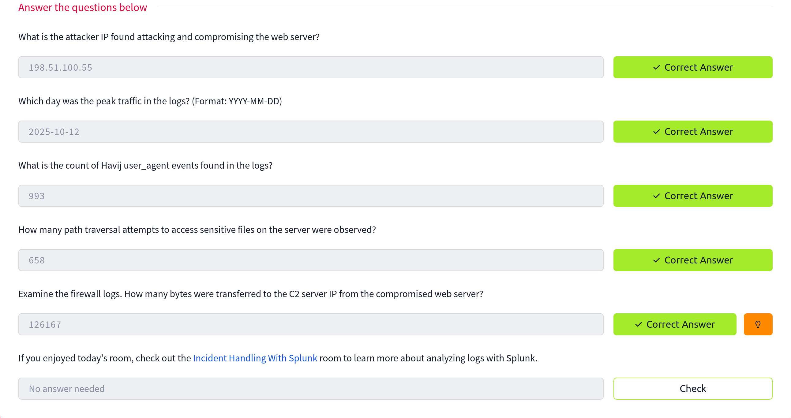

# `Splunk` Basics

Splunk is a platform for collecting, storing, and analysing machine data. It provides various tools for analysing data, including search, correlation, and visualisation. It is a powerful tool that organisations of all sizes can use to improve their IT operations and security posture.

- Used the tutorial to find the answers to all questions,
- Used the queries provided and understanding how and why they are used.

## Reference : https://tryhackme.com/room/splunkforloganalysis-aoc2025-x8fj2k4rqp
