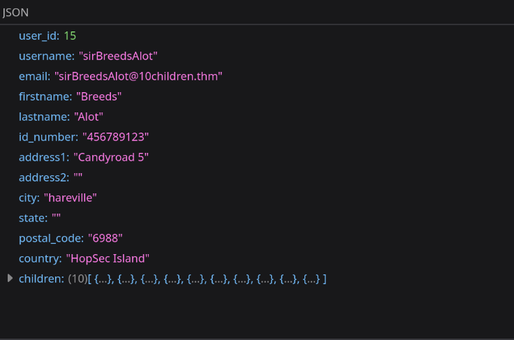

# `IDOR` - Santa’s Little `IDOR`

IDOR stands for **Insecure Direct Object Reference** and is a type of access control vulnerability. Web applications often use references to determine what data to return when you make a request. However, if the web server doesn't perform checks to ensure you are allowed to view that data before sending it, it can lead to serious sensitive information disclosure.

## Identity Defines Our Reach

To understand the root cause of IDOR, it is important to understand the basic principles of authentication and authorization:

- **Authentication:** The process by which you verify who you are. For example, supplying your username and password.
- **Authorization:** The process by which the web application verifies your permissions. For example, are you allowed to visit the admin page of a web application, or are you allowed to make a payment using a specific account?

You may think that authentication only happens once when you supply your username and password, but that is actually not the case! After providing your credentials, you receive a cookie or a token, called session information. Every subsequent request you make to the application includes this session information, which is verified by the application. This initial verification process is still authentication and happens for each request. This is why websites will often redirect you back to the login page. It means your session information has expired, and thus, you need to reauthenticate with your credentials to receive new session information.

Authorization cannot happen before authentication. If the application doesn't know who you are, it cannot verify what permissions your user has. This is very important to remember. If your IDOR doesn't require you to authenticate (login or provide session information), such as in our package tracking example, we will have to fix authentication first before we can fix the authorization issue of making sure that users can only get information about packages they own.

The last bit of theory to cover is privilege escalation types:

- **Vertical privilege escalation:** This refers to privilege escalation where you gain access to more features. For example, you may be a normal user on the application, but can perform actions that should be restricted for an administrator.
- **Horizontal privilege escalation:** This refers to privilege escalation where you use a feature you are authorized to use, but gain access to data that you are not allowed to access. For example, you should only be able to see your accounts, not someone else's accounts.

IDOR is usually a form of horizontal privilege escalation. You are allowed to make use of the track package functionality. But you should be restricted to only performing that tracking action for packages you own. Now that we understand the theory, let's look at how to exploit IDOR practically!

## 1. 
**What does IDOR stand for?**
- `Insecure Direct Object Reference`

## 2. 
**What type of privilege escalation are most IDOR cases?**
- `Horizontal`

## 3. 
**Exploiting the `IDOR` found in the `view_accounts` parameter, what is the `user_id` of the parent that has 10 children?**
- I kept changing the `user_id` till I found the entry which has 10 children.
	
	
