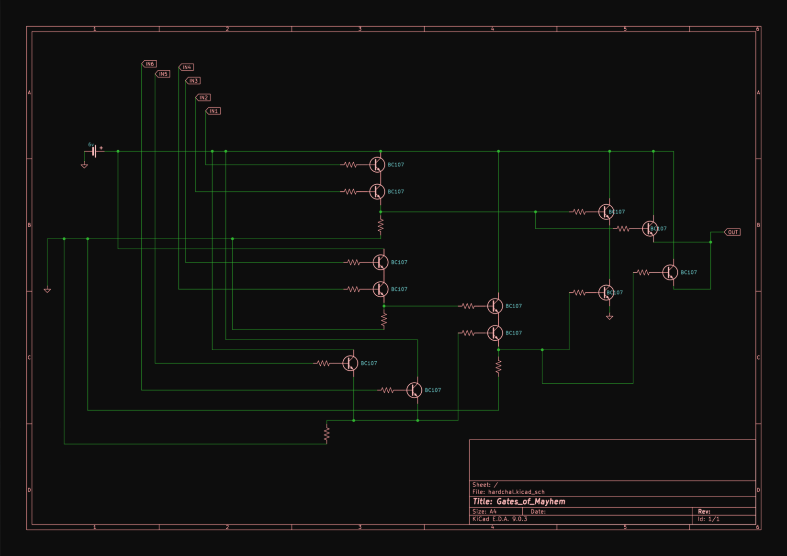
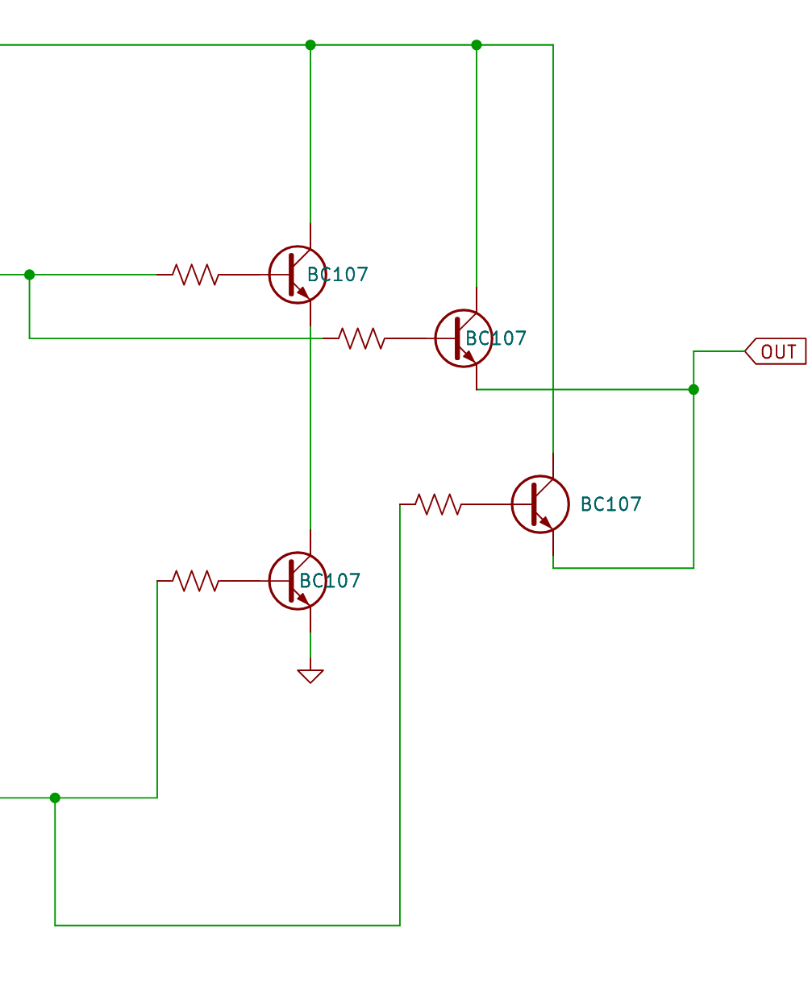
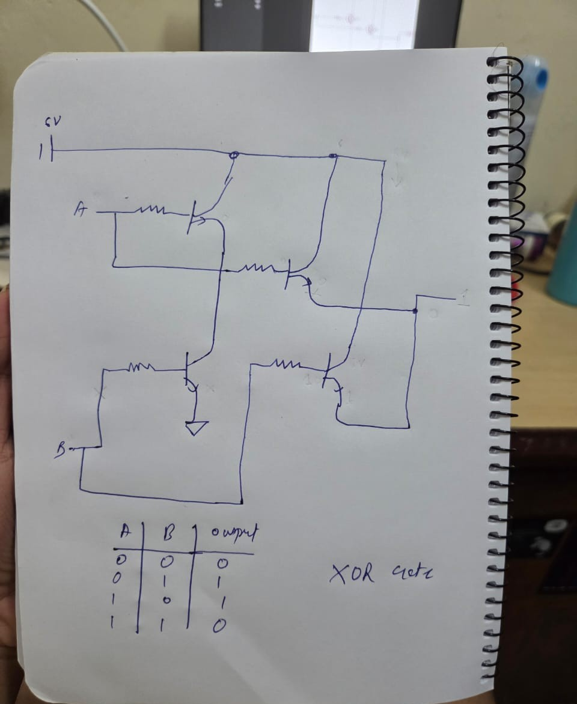
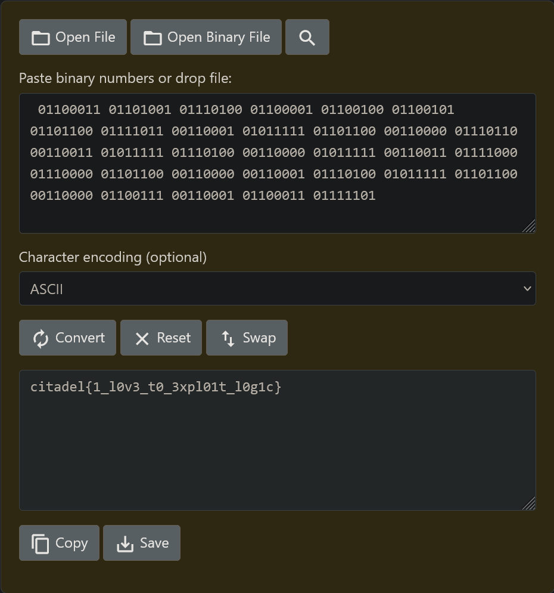
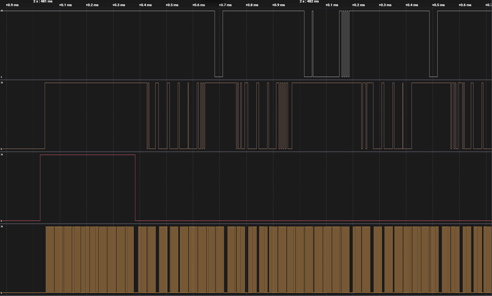
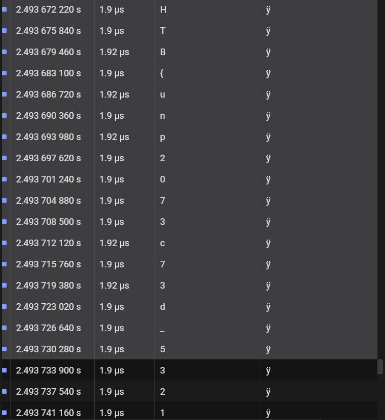

# 1. Gates of Mayhem
>iqtest but its on steriods and you have weird aah inputs aswell.

>Two files were provided, `input_sequence.csv` and `gates_of_mayhem.pdf`

>The csv file contained 256 values for each input.

>This was the schematic provided in the pdf file:
	

## Solve:
- Having no idea about the component used here, I searched the code number `BC107` on google and found it that these were `npn` type `BJT` transistors.
- Seeing all the values in the `csv`, I could figure out that these inputs were going through some gates, so I searched logic gates using the `BJT` transistors and found this-
	- https://www.instructables.com/Logic-Gates-with-NPN-transistors/
- From here I could figure out the basic gates at the start of the circuit
	- The `IN1` and `IN2` signals went through an `AND` gate
	- The `IN3` and `IN4` signals also went through an `AND` gate
	- But the `IN5` and `IN6` signals went through an `OR` gate
	- After that the output `IN5+IN6` went through another `AND` gate with the output of `IN3*IN4`
	- After that I couldn't figure out what happened here-
	
		

- For this I took out my pen and paper, and tried to create a truth table for the following section,
	
	
	- This resulted in an `XOR` gate.

- Now the Final expression was `(1*2)^((3*4)*(5+6))`
- For this I created a python script
```python
inp1 = ['1', '1', '1'...] #upto 256 values
inp2 = ['0', '0', '0'...]
inp3 = ['0', '1', '1'...]
inp4 = ['0', '1', '1'...]
inp5 = ['1', '1', '0'...]
inp6 = ['0', '1', '1'...]
output = []

for i in range(256):
	exp1 = int(inp1[i]) and int(inp2[i])
	exp2 = int(inp3[i]) and int(inp4[i])
	exp3 = int(inp5[i]) or int(inp6[i])
	exp4 = exp2 and exp3
	exp5 = exp4 ^ exp1
	output.append(exp5)

for i in range(256):
	if ((i)%8==0):
		print(" ", end="")
	print((output[i]), end="")
```

- This was the output I recieved-
```zsh
01100011 01101001 01110100 01100001 01100100 01100101 01101100 01111011 00110001 01011111 01101100 00110000 01110110 00110011 01011111 01110100 00110000 01011111 00110011 01111000 01110000 01101100 00110000 00110001 01110100 01011111 01101100 00110000 01100111 00110001 01100011 01111101
```
- Converting it to ascii I got the flag-

	

## Flag:
```
citadel{1_l0v3_t0_3xpl01t_l0g1c}
```

## Notes and Concepts Learnt:
- I learnt how BJT `npn` transistors work and how to makes gates with them.
- I learnt how to read schematics. 


# 2. I Like Logic More
>idk man, i feel like microsd cards are a thing of the past.

## Solve:
- Like one of  the previous hardware challenge, I was provided with a `.sal` file which I opened up in the `Saleae Logic` software.

	
- Looking at the `README`, I tried searching for the protocol used by SD cards, and I landed on this website: https://www.prodigytechno.com/spi-protocol
- I found it is SPI protocol which has 4 channels.
	- `MISO`- Master In Slave Out
	- `MOSI`- Master Out Slave In
	- Clock
	- Clock Enable
- Now the problem was to locate which channel was which,
	- The channel which repetitive and clean was supposed to be the Clock
	- The Enable is the one which'll go low before clock start
	- MOSI and MISO I tried to interchange.
- After getting some good ascii characters, I scrolled and scrolled and got this
    - MOSI -> Channel 0
    - MOSI -> Channel 1
    - Clock -> Channel 3
    - Enable -> Channel 2

	
- Using this I was able to get the flag

## Flag:
```
HTB{unp2073c73d_532141_p2070c015_0n_53cu23_d3v1c35}
```

## Notes and Concepts Learnt:
- I learnt how SPI protocol is configured and what are the different channels it is operated on.
