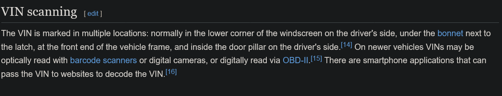
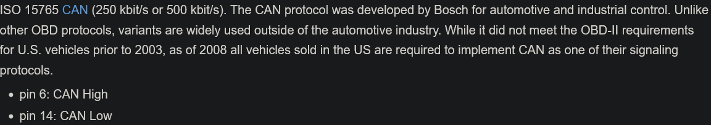
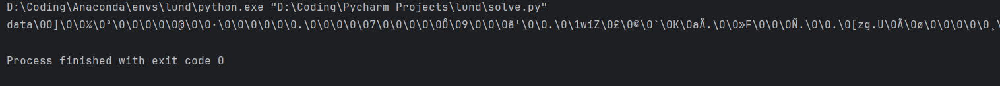
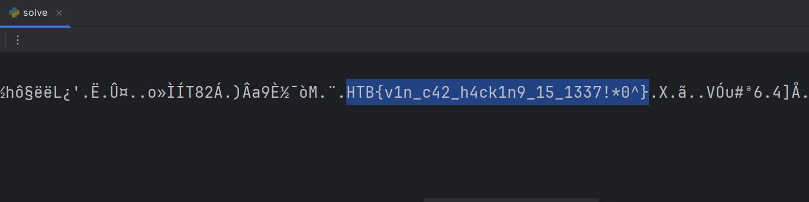
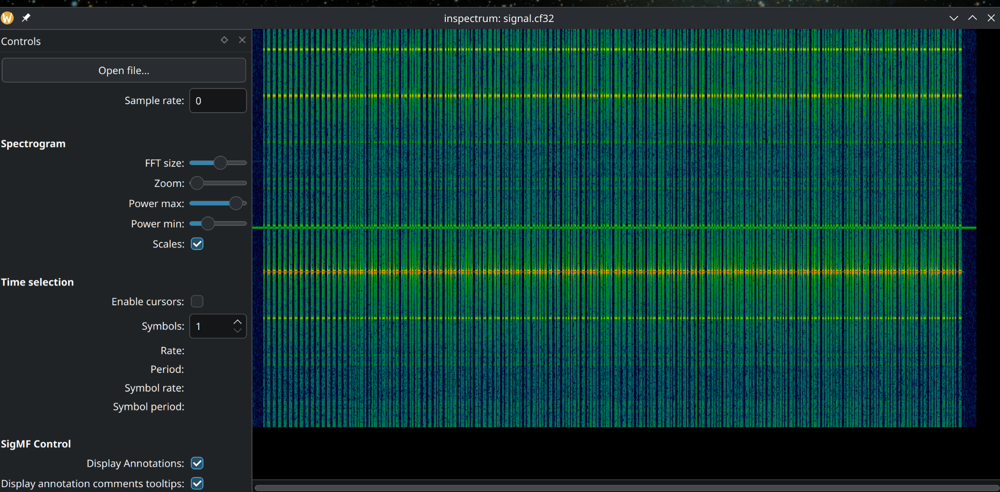
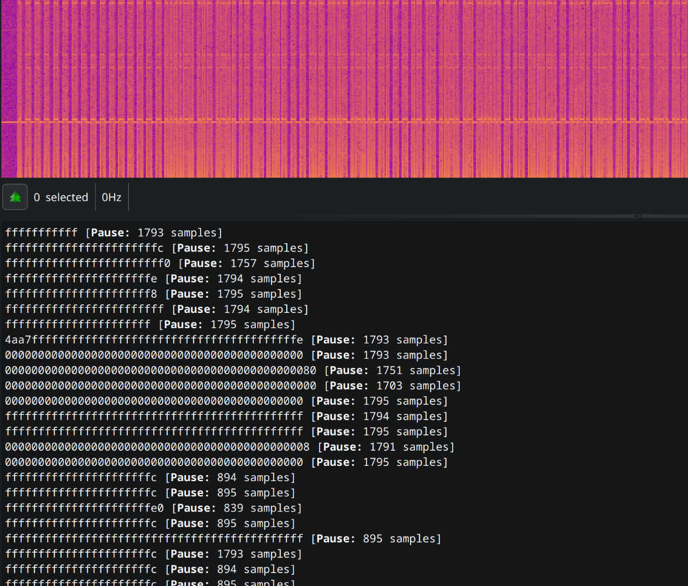
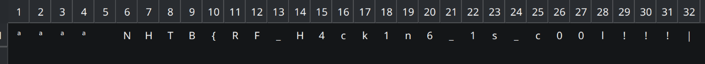
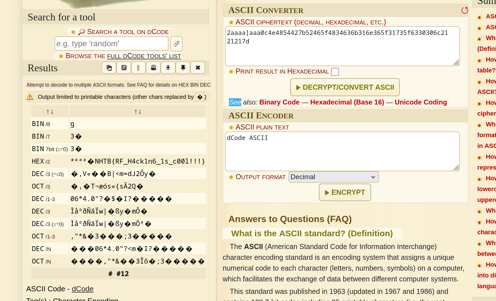

# 1. Gates of Mayhem
>iqtest but its on steriods and you have weird aah inputs aswell.

>Two files were provided, `input_sequence.csv` and `gates_of_mayhem.pdf`

>The csv file contained 256 values for each input.

>This was the schematic provided in the pdf file:
	

## Solve:
- Having no idea about the component used here, I searched the code number `BC107` on google and found it that these were `npn` type `BJT` transistors.
- Seeing all the values in the `csv`, I could figure out that these inputs were going through some gates, so I searched logic gates using the `BJT` transistors and found this-
	- https://www.instructables.com/Logic-Gates-with-NPN-transistors/
- From here I could figure out the basic gates at the start of the circuit
	- The `IN1` and `IN2` signals went through an `AND` gate
	- The `IN3` and `IN4` signals also went through an `AND` gate
	- But the `IN5` and `IN6` signals went through an `OR` gate
	- After that the output `IN5+IN6` went through another `AND` gate with the output of `IN3*IN4`
	- After that I couldn't figure out what happened here-
	
		

- For this I took out my pen and paper, and tried to create a truth table for the following section,
	
	
	- This resulted in an `XOR` gate.

- Now the Final expression was `(1*2)^((3*4)*(5+6))`
- For this I created a python script
```python
inp1 = ['1', '1', '1'...] #upto 256 values
inp2 = ['0', '0', '0'...]
inp3 = ['0', '1', '1'...]
inp4 = ['0', '1', '1'...]
inp5 = ['1', '1', '0'...]
inp6 = ['0', '1', '1'...]
output = []

for i in range(256):
	exp1 = int(inp1[i]) and int(inp2[i])
	exp2 = int(inp3[i]) and int(inp4[i])
	exp3 = int(inp5[i]) or int(inp6[i])
	exp4 = exp2 and exp3
	exp5 = exp4 ^ exp1
	output.append(exp5)

for i in range(256):
	if ((i)%8==0):
		print(" ", end="")
	print((output[i]), end="")
```

- This was the output I recieved-
```zsh
01100011 01101001 01110100 01100001 01100100 01100101 01101100 01111011 00110001 01011111 01101100 00110000 01110110 00110011 01011111 01110100 00110000 01011111 00110011 01111000 01110000 01101100 00110000 00110001 01110100 01011111 01101100 00110000 01100111 00110001 01100011 01111101
```
- Converting it to ascii I got the flag-

	

## Flag:
```
citadel{1_l0v3_t0_3xpl01t_l0g1c}
```

## Notes and Concepts Learnt:
- I learnt how BJT `npn` transistors work and how to makes gates with them.
- I learnt how to read schematics. 


# 2. I Like Logic More
>idk man, i feel like microsd cards are a thing of the past.

## Solve:
- Like one of  the previous hardware challenge, I was provided with a `.sal` file which I opened up in the `Saleae Logic` software.

	
- Looking at the `README`, I tried searching for the protocol used by SD cards, and I landed on this website: https://www.prodigytechno.com/spi-protocol
- I found it is SPI protocol which has 4 channels.
	- `MISO`- Master In Slave Out
	- `MOSI`- Master Out Slave In
	- Clock
	- Clock Enable
- Now the problem was to locate which channel was which,
	- The channel which repetitive and clean was supposed to be the Clock
	- The Enable is the one which'll go low before clock start
	- MOSI and MISO I tried to interchange.
- After getting some good ascii characters, I scrolled and scrolled and got this
    - MOSI -> Channel 0
    - MOSI -> Channel 1
    - Clock -> Channel 3
    - Enable -> Channel 2

	
- Using this I was able to get the flag

## Flag:
```
HTB{unp2073c73d_532141_p2070c015_0n_53cu23_d3v1c35}
```

## Notes and Concepts Learnt:
- I learnt how SPI protocol is configured and what are the different channels it is operated on.

# 3. Speed Thrills But Kills
>i recently got involved in a hit and run case in pune, that kids porsche was going wayy too fast, if only i knew what the VIN of the car was :(

> One `.sal` file was also provided.

## Solve:
- Looking at the description provided, I search what is `VIN` and how it is related to cars.
	- Through google, I found that, `VIN` is `Vehicle Identification Number` which is a 17 character code, that serves as the car's fingerprint used to identify it and its history.
- Searching through the Wikipedia page, I was able to locate this section,
	
	
-  This said that the car's VIN could be digitally read with `OBD-II` which is `On-Board Diagnostics`, and looking at its signal protocols, I was shown a lot of protocols through which I could analyze the signal. 
- Looking at the description of them all, I could see that the `CAN` protocol was a must for vehicles after the year 2008.
	
	
- So I opened up the signal file in the `Saleae Logic` software.
- First to analyze the signal using the `CAN` analyzer, I had to find the bit rate or the `baud` rate of the signal,
	- Searching on google, I found that common baud rates for `CAN` were `125 kbit/s`, `125 kbit/s`, `250 kbit/s`,  `500 kbit/s` and `1000 kbit/s`
	- Trying to use them one by one, I could only receive data on the `125000 kbit/s` baud rate.
	
	
- The received data I got, I exported as `csv` data and tried reading it through python. This was the `csv` data structure.
```
name,start_time,duration,"data","identifier","num_data_bytes","crc"
```

```python
import csv  
  
decoded_message = ""  
with open("data.csv", encoding="utf-8") as file:  
    data = csv.reader(file)  
    for line in data:  
        decoded_message += line[3]  
  
print(decoded_message)
```
- This is the output I received-
	
	
	- It was very long and had a lot of escape characters (`\0`)
- I used python to remove all the escape characters and then ran the program again and in the midst of unwanted characters, I was able to locate the flag.
	
	
```
...LòM.¨.HTB{v1n_c42_h4ck1n9_15_1337!*0^}.X...
```

## Flag:
```
HTB{v1n_c42_h4ck1n9_15_1337!*0^}
```

## Notes and Concept Learnt:
- I learnt about the `CAN` protocol which is `Control Area Network` bus, designed to enable efficient communication primarily between electronic control units.
- Baud rate for `CAN` is usually `125`, `250`, `500` or `1000` kbit/s.
- I learnt how are `CAN` signals are decoded and can be used to discover hidden data.
- I learnt how to export data table from `Saleae Logic` and analyze them using python.


# 4. Formwear

> this is most definitely going to ring some bells for those who attended the "router hijacking" workshop L0L

>Three files were provided:
>	fwu_ver
>	hw_ver
>	rootfs


## Solve:
- The files `fwu_ver` and `hw_ver` were text files, which contained the firmware and the hardware versions respectively.
	- The firmware version was `3.0.5`
	- The Hardware version was `X1`
- The third file was a `sqaushfs` filesystem.
	- Searching it up, I found that `sqauashfs` is a compressed, read-only Linux system designed for use in general archiving and in embedded systems.
- I learnt that it could be mounted on my system by these commands
```zsh
sudo mount -o loop rootfs /mnt/squashfs_mount
```
- Using `ls` in the created mount, I was shown these folders.
```zsh
sparsh@LAPTOP-F80QI4V2 /mnt/squashfs_mount $ ls
bin  config  dev  etc  home  image  lib  mnt  overlay  proc  run  sbin  sys  tmp  usr  var
```
	 This file structure resembled a linux system
- The first place I looked at was the `home` directory, under that I could see a hidden user directory called `.41fr3d0`, or "Alfredo", in that there was a file called `s.txt` which had the contents `almost there`
```zsh
sparsh@LAPTOP-F80QI4V2 /mnt/squashfs_mount/home $ ls -la
total 0
drwxrwxr-x  3 root root  31 Oct  1  2023 .
drwxrwxr-x 14 root root 257 Aug 10  2022 ..
drwxr-xr-x  2 root root  28 Oct  1  2023 .41fr3d0
sparsh@LAPTOP-F80QI4V2 /mnt/squashfs_mount/home $ cd .41fr3d0
sparsh@LAPTOP-F80QI4V2 /mnt/squashfs_mount/home/.41fr3d0 $ ls
s.txt
sparsh@LAPTOP-F80QI4V2 /mnt/squashfs_mount/home/.41fr3d0 $ cat s.txt
almost there
```
	There was nothing else contained in this folder
- The next thing I wanted to do was look for file that had readable data, the only `.txt` file was the one I had already seen, so I tried searching for `markup` files like `xml`, `yaml`, `html` etc.
- The only files that existed on the system were `.xml` files in the `etc` directory.
```zsh
sparsh@LAPTOP-F80QI4V2 /mnt/squashfs_mount $ find . -name "*.yaml"
sparsh@LAPTOP-F80QI4V2 /mnt/squashfs_mount $ find . -name "*.html"
sparsh@LAPTOP-F80QI4V2 /mnt/squashfs_mount $ find . -name "*.xml"
./etc/config_default.xml
./etc/config_default_hs.xml
./etc/simplecfgservice.xml
```
- So I entered the `etc` directory and used `cat` on the `xml` files and grepped the content with `{*}` in an attempt to find the flag.
```zsh
sparsh@LAPTOP-F80QI4V2 /mnt/squashfs_mount/etc $ cat *.xml | grep "{*}"
<Value Name="SUSER_PASSWORD" Value="HTB{N0w_Y0u_C4n_L0g1n}"/>
```
- And surprisingly, the flag was the super user password which I should've tried to locate before.

## Flag:
```python
HTB{N0w_Y0u_C4n_L0g1n}
```

## Notes and Concepts Learnt:
- I learnt what are `sqaushfs` files
- `sqauashfs` is a compressed, read-only Linux system designed for use in general archiving and in embedded systems.
- It could be mounted using the `mount` command
- In CTF problems like these, the first attempt should be to locate the super user password as that is the most crucial part of a linux system.


# 5. Red Devil
>this is the worst football team ever(i dont even watch football lmeow)

> A .cf32 file was provided

## Solve:
- Downloading the file, first I looked what a `.cf32` is, and how it works.
	- Basically `.cf32` file is A `.cf32` file is a raw data file used in Software-Defined Radio (SDR) and radar, containing Complex Float 32-bit data, essentially un-processed In-phase (I) and Quadrature (Q) samples, often stored in little-endian format (32-bit float for each I and Q sample)
- Searching around the net, I was able to find a very simple utility called `rtl-433` but we were supposed to do this challenge without this so I had to figure.
- Using `inspectogram`, I was able to get a graph but it seemed to be of no use.
	
	
- So first I read what are the different types of digital radio frequency modulations
	- https://resources.pcb.cadence.com/blog/2023-rf-modulation-types
	- **In Amplitude Shift Keying (ASK)**, different amplitude levels are assigned to different binary values. The carrier wave’s instantaneous amplitude is modified based on the digital signal’s value.
	- **In Frequency Shift Keying (FSK)**, the carrier frequency is switched between two predetermined frequencies, one representing a binary 0 and the other representing a binary 1. 
	- **In Phase Shift Keying (PSK)**, the phase of the carrier wave is adjusted at specific intervals based on the digital signal being transmitted
	- **[Quadrature Amplitude Modulation (QAM)](https://resources.system-analysis.cadence.com/blog/msa2021-enhance-data-rates-and-bandwidth-with-quadrature-amplitude-modulation)** is a method that involves two message signals. The amplitudes of two carrier waves are modulated (often using ASK). These two carrier waves are out of phase with each other by 90 degrees. The waves are then added together to create a single signal. Once broadcasted and received, these two signals are demodulated and then separated. QAM’s higher data rate capabilities and robustness to [noise and interference](https://resources.pcb.cadence.com/blog/2022-rf-interference-types-and-effects) make it a preferred choice for various digital communication systems.
- And to analyze the file provided, I downloaded `Universal Radio Hacker`
- First opening the software and inputting the file, I could already see an output in the output window,
	
	
- The signal waves resembled `ASK` modulation and the durations were either in the range of 890-895 or 1790-1795, approximately the double of the other
- These durations pointed to `Manchester II` encoding
- The changes I made were-
	- I changed the modulation to `ASK` or Amplitude Shift Keying
	- I changed the samples/symbol to 895
	- And in analysis tab, I changed the decoding to `Manchester II`
- This was the output I received-
	
	

## Alternate Solve (using rtl-433):
- Just install`rtl-433`
- Use this command:
```
rtl_433 -A signal.cf32
```
- This was the output I received:
```bash
thecosmic@fedora ~/Downloads $ rtl_433 -A signal.cf32
rtl_433 version 25.02 (2025-02-19) inputs file rtl_tcp RTL-SDR SoapySDR
Reading conf from "/etc/rtl_433/rtl_433.conf".
[Input] Test mode active. Reading samples from file: signal.cf32
Detected OOK package	@0.220228s
Analyzing pulses...
Total count:  185,  width: 1837.12 ms		(459281 S)
Pulse width distribution:
 [ 0] count:  114,  width: 3608 us [3604;3624]	( 902 S)
 [ 1] count:   71,  width: 7204 us [7200;7208]	(1801 S)
Gap width distribution:
 [ 0] count:   71,  width: 7172 us [7172;7180]	(1793 S)
 [ 1] count:  113,  width: 3576 us [3576;3584]	( 894 S)
Pulse period distribution:
 [ 0] count:   57,  width: 10784 us [10780;10796]	(2696 S)
 [ 1] count:   42,  width: 14380 us [14376;14384]	(3595 S)
 [ 2] count:   85,  width: 7188 us [7184;7196]	(1797 S)
Pulse timing distribution:
 [ 0] count:  227,  width: 3592 us [3576;3624]	( 898 S)
 [ 1] count:  142,  width: 7188 us [7172;7208]	(1797 S)
 [ 2] count:    1,  width: 72084 us [72084;72084]	(18021 S)
Level estimates [high, low]:  15985,    488
RSSI: -0.2 dB SNR: 30.3 dB Noise: -30.5 dB
Frequency offsets [F1, F2]:   -5928,      0	(-22.6 kHz, +0.0 kHz)
Guessing modulation: Manchester coding
view at https://triq.org/pdv/#AAB1030E081C14FFFF819191919191919191919191919191918080808090818080918090808180918091808080919191808091808080918090808081908191918091809180809081809190808080819180918080808090819180809081808090819081919081809081808091908190808180809081908180919080808081809081808091908081809081919080808081908180809081809081808080808090818080808090819081808080918080809180918080809180918080809190808080819255
Attempting demodulation... short_width: 3608, long_width: 0, reset_limit: 7184, sync_width: 0
Use a flex decoder with -X 'n=name,m=OOK_MC_ZEROBIT,s=3608,l=0,r=7184'
[pulse_slicer_manchester_zerobit] Analyzer Device
codes     : {256}2aaaaaaa0c4e4854427b52465f4834636b316e365f31735f6330306c2121217d
```
- This ASCII code was found, `2aaaaaaa0c4e4854427b52465f4834636b316e365f31735f6330306c2121217d`
- Decoding it, the flag was revealed
	
	
## Flag:
```
NHTB{RF_H4ck1n6_1s_c00l!!!}
```

## Notes and Concepts Learnt:
- I learnt what is `URH` and how `URH` is used.
- I learnt the different types of digital radio frequencies and modulation and encoding techniques