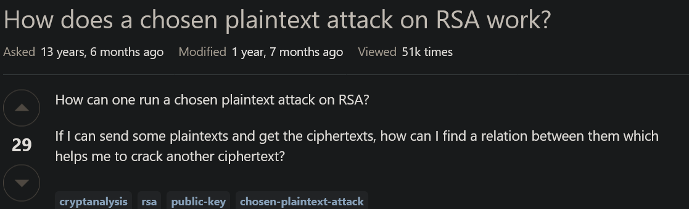
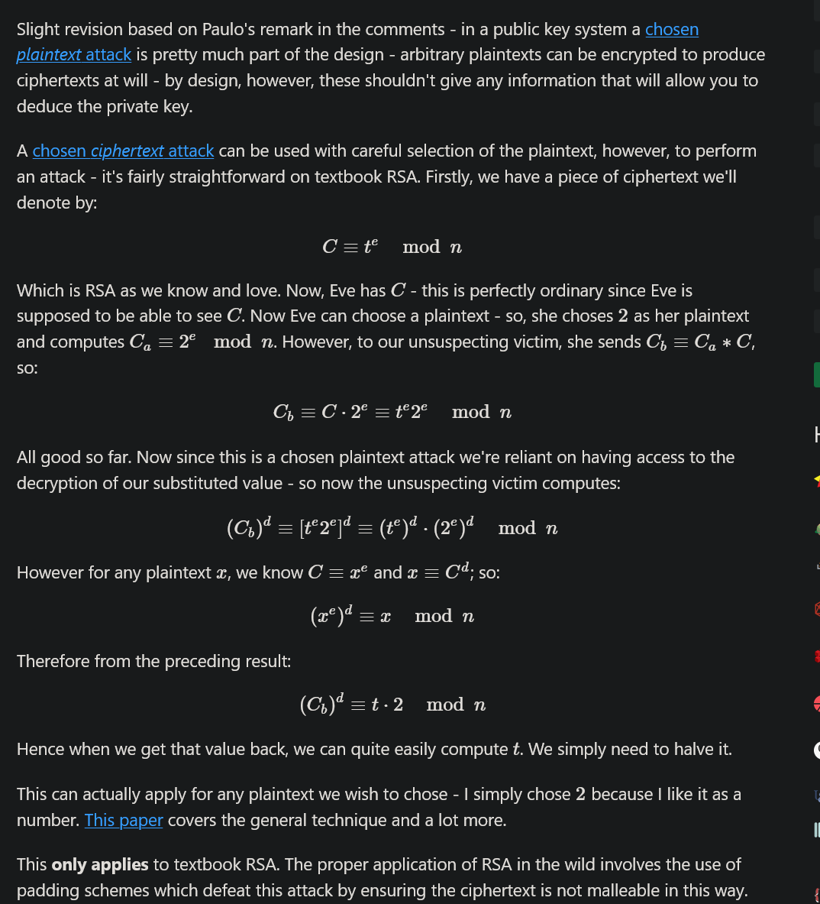
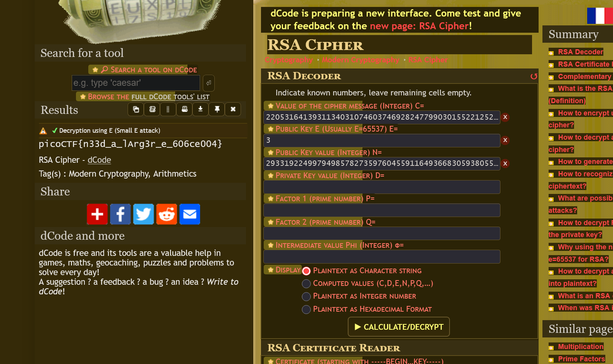

# 1. RSA Oracle

>Can you abuse the oracle? An attacker was able to intercept communications between a bank and a fintech company. They managed to get the [message](https://artifacts.picoctf.net/c_titan/151/secret.enc) (ciphertext) and the [password](https://artifacts.picoctf.net/c_titan/151/password.enc) that was used to encrypt the message.
>After some intensive reconassainance they found out that the bank has an oracle that was used to encrypt the password and can be found here `nc titan.picoctf.net 52430`. Decrypt the password and use it to decrypt the message. The oracle can decrypt anything except the password.


## Solve: 

First I read about RSA, how it works and how it encrypts and decrypts a message.
- Then booting up the challenge through the `nc` port, I was shown a program that could decrypt and encrypt text through its RSA encryption algorithm. But when inputting the password given, it would not provide the decrypted message for it.
```
sparsh@LAPTOP-F80QI4V2 ~/ctf2/cusen $ nc titan.picoctf.net 52430
*****************************************
****************THE ORACLE***************
*****************************************
what should we do for you?
E --> encrypt D --> decrypt.
E
enter text to encrypt (encoded length must be less than keysize): password123
password123

encoded cleartext as Hex m: 70617373776f7264313233

ciphertext (m ^ e mod n) 3671275645359602079321918958559826502400235535142294324062114725227883806163370270675649450924937463525094676155610801615375868221054370485869798703144128

what should we do for you?
E --> encrypt D --> decrypt.
D
Enter text to decrypt: 3671275645359602079321918958559826502400235535142294324062114725227883806163370270675649450924937463525094676155610801615375868221054370485869798703144128
decrypted ciphertext as hex (c ^ d mod n): 70617373776f7264313233
decrypted ciphertext: password123
```
- Here in no way, the algorithm was exposed, I couldn't figure out the private key using this so I looked at one of the hints.

- Then looking at one of the hints, it said that the attack is a "chosen plaintext attack"

- So I searched RSA CPA on google and landed on a `crypto stack exchange` page which briefly explained the same problem.


- This was the solution given,


- Through this, I solved the challenge in the following steps-
	- First I encrypted the string "2" through the `Oracle`, that resulted in `4707619883686427763240856106433203231481313994680729548861877810439954027216515481620077982254465432294427487895036699854948548980054737181231034760249505`
	- Then I multiplied this with the encrypted password, that resulted in `19905104266461674438427749120035481333430848061235340017498754943327360989060077822957076637919794979148279735224896131374733698562836139551270909235193224215437233163101052237584916525504858889351339402233392061749581481707426238265002525969310836283110708030433599547806496303497230632152297549255724839730`
	- Then I ran this through the decryption and got this decrypted hex - `0x139afb6b2d22`
	- Then I divided this hex with the string "2" which is 50 in `ascii`, this resulted in `431127279929` or `6461303939` in hex.
	- Converting this to `ascii` text, I got the decrypted password which was `da099`
- After finding the password, it was easy, I just ran the `openssl` command provided and got the flag
```zsh
sparsh@LAPTOP-F80QI4V2 ~/ctf2/rsao $ openssl enc -aes-256-cbc -d -in secret.enc -k da099
*** WARNING : deprecated key derivation used.
Using -iter or -pbkdf2 would be better.
picoCTF{su((3ss_(r@ck1ng_r3@_da099d93}
```
## Flag:
```
picoCTF{su((3ss_(r@ck1ng_r3@_da099d93}
```
## Notes and Concepts Learnt:
- I learnt how RSA encryption works.
- Chosen Plaintext Attack is an attack where the attacker can an attacker can chose plaintexts and get the corresponding ciphertexts. This allows the attacker to analyze the algorithm and find a vulnerability to exploit
- Reference Used: `https://crypto.stackexchange.com/questions/2323/how-does-a-chosen-plaintext-attack-on-rsa-work`

# 2. Custom Encryption
>Can you get sense of this code file and write the function that will decode the given encrypted file content. Find the encrypted file here [flag_info](https://artifacts.picoctf.net/c_titan/16/enc_flag) and [code file](https://artifacts.picoctf.net/c_titan/16/custom_encryption.py) might be good to analyze and get the flag.

Contents of `custom_encryption.py`:
```python
from random import randint
import sys


def generator(g, x, p):
    return pow(g, x) % p


def encrypt(plaintext, key):
    cipher = []
    for char in plaintext:
        cipher.append(((ord(char) * key*311)))
    return cipher


def is_prime(p):
    v = 0
    for i in range(2, p + 1):
        if p % i == 0:
            v = v + 1
    if v > 1:
        return False
    else:
        return True


def dynamic_xor_encrypt(plaintext, text_key):
    cipher_text = ""
    key_length = len(text_key)
    for i, char in enumerate(plaintext[::-1]):
        key_char = text_key[i % key_length]
        encrypted_char = chr(ord(char) ^ ord(key_char))
        cipher_text += encrypted_char
    return cipher_text


def test(plain_text, text_key):
    p = 97
    g = 31
    if not is_prime(p) and not is_prime(g):
        print("Enter prime numbers")
        return
    a = randint(p-10, p)
    b = randint(g-10, g)
    print(f"a = {a}")
    print(f"b = {b}")
    u = generator(g, a, p)
    v = generator(g, b, p)
    key = generator(v, a, p)
    b_key = generator(u, b, p)
    shared_key = None
    if key == b_key:
        shared_key = key
    else:
        print("Invalid key")
        return
    semi_cipher = dynamic_xor_encrypt(plain_text, text_key)
    cipher = encrypt(semi_cipher, shared_key)
    print(f'cipher is: {cipher}')


if __name__ == "__main__":
    message = sys.argv[1]
    test(message, "trudeau")
```

contents of `enc_flag` :
```
a = 97
b = 22
cipher is: [151146, 1158786, 1276344, 1360314, 1427490, 1377108, 1074816, 1074816, 386262, 705348, 0, 1393902, 352674, 83970, 1141992, 0, 369468, 1444284, 16794, 1041228, 403056, 453438, 100764, 100764, 285498, 100764, 436644, 856494, 537408, 822906, 436644, 117558, 201528, 285498]
```
## Solve:
- Looking at the code for the first time, it looked very complex.
- Breaking it down:
	- First in the main function, two numbers p and g are defined, using these two more numbers a which is a random number between (p-10, p) and b which is a random number between (g-10 , g)
	- These a and b are provided to me through the `enc_flag` file, `a=97, b=22`.
	- Now `u`, `v`, `key` and `b_key` are calculated via the `generator` function which takes three parameters and excise them with a RSA sort of algorithm `pow(g, x) % p`.
		- `u` = 31
		- `v` = 54
		- `key` = 54
		- `b_key` = 54
	- So here `shared key` is 54
- After this the plain text is XORed with the test key `tradeau`, after that it is passed through the `encrypt` function where each string's each character's ascii  is multiplied by the shared key and 311.
- Lastly, it generates list of decimal values that are encrypted form of the plain text.
- I created a python script to decrypt this data, it mimics the original file, just reverts all the steps one by one.
```python

encrypted_nums = [151146, 1158786, 1276344, 1360314, 1427490, 1377108, 1074816, 1074816, 386262, 705348, 0, 1393902, 352674, 83970, 1141992, 0, 369468, 1444284, 16794, 1041228, 403056, 453438, 100764, 100764, 285498, 100764, 436644, 856494, 537408, 822906, 436644, 117558, 201528, 285498]

xor_text = []
xor_ascii_number = []
xor_ascii_bin = []

divisor = 311 * 54
for i in range(len(encrypted_nums)):
    y = chr(int(encrypted_nums[i]/divisor))
    xor_ascii_number.append(int(encrypted_nums[i]/divisor))
    xor_text.append(y)


semi_ciphertext = "".join(xor_text)


plaintext = ""
text_key = "trudeau"
key_length = len(text_key)
for i, char in enumerate(semi_ciphertext):
    key_char = text_key[i % key_length]
    decrypted_char = chr(ord(char) ^ ord(key_char))
    plaintext += decrypted_char
print(plaintext[::-1])
```
- I got the following output:
```zsh
sparsh@LAPTOP-F80QI4V2 ~/ctf2/custom $ python3 solver.py
picoCTF{custom_d2cr0pt6d_e4530597}
```

## Flag:
```
picoCTF{custom_d2cr0pt6d_e4530597}
```

## Notes and Concepts Learnt:
- This question was a great practice on creating a decrypt script when you have the encrypt algorithm.

# 3. miniRSA
> Let's decrypt this: ciphertext? Something seems a bit small.

Content of ciphertext:
```
N: 29331922499794985782735976045591164936683059380558950386560160105740343201513369939006307531165922708949619162698623675349030430859547825708994708321803705309459438099340427770580064400911431856656901982789948285309956111848686906152664473350940486507451771223435835260168971210087470894448460745593956840586530527915802541450092946574694809584880896601317519794442862977471129319781313161842056501715040555964011899589002863730868679527184420789010551475067862907739054966183120621407246398518098981106431219207697870293412176440482900183550467375190239898455201170831410460483829448603477361305838743852756938687673
e: 3

ciphertext (c): 2205316413931134031074603746928247799030155221252519872649649212867614751848436763801274360463406171277838056821437115883619169702963504606017565783537203207707757768473109845162808575425972525116337319108047893250549462147185741761825125
```
## Solve:

- Due to `RSA Oracle` challenge, I already had a pretty solid idea regarding what `N`, `e`, `C` is.
  Here N -> Shared Key
  e -> Public Exponent
  C -> Ciphertext
- I opened up `dcode.fr`, selected the `rsa-cipher` and inputted the values provided in the challenge 

	Through this I was able to get the flag very easily.

## Flag:
```
picoCTF{n33d_a_lArg3r_e_606ce004}
```

## Notes and Concepts Learnt:
- `dcode.fr` is a very helpful tool in the field of cryptography and has a variety of different ciphers through which you can either encrypt or decrypt.

