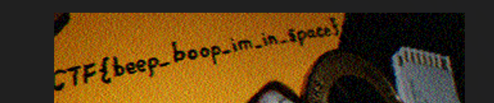

# 1. Trivial Flag Transfer Protocol
> Figure out how they moved the [flag](https://mercury.picoctf.net/static/cc6074838ede2edf9f805fd2b58bdc58/tftp.pcapng).

## Solve:
- Having some prior experience on working with `pcapng` or packet capture files, I fired up Wireshark only to realize I am on the wrong version of the software.
- After making no progress, I downloaded the older version of Wireshark and loaded the capture file in it.
- After some reading around `TFTP` or Trivial File Transfer Protocol, I got to know how it is used to transfer files between clients and servers. I read about how to extract files from the packet capture file.
- The path to exporting files was-
	- Files --> Export Objects --> TFTP --> Save All
- Through this I got the following files:

	

- Opening up `instructions.txt`:
	- The contents were `GSGCQBRFAGRAPELCGBHEGENSSVPFBJRZHFGQVFTHVFRBHESYNTGENAFSRE.SVTHERBHGNJNLGBUVQRGURSYNTNAQVJVYYPURPXONPXSBEGURCYNA
	- This was ROT13 Cipher as identified by our trusty friend `dcode.fr`, and translated to `TFTP DOESNT ENCRYPT OUR TRAFFIC SO WE MUST DISGUISE OUR FLAG TRANSFER.FIGURE OUT A WAY TO HIDE THE FLAG AND I WILL CHECK BACK FOR THEPLAN`
- This pointed to `plan`
	- The contents were `VHFRQGURCEBTENZNAQUVQVGJVGU-QHRQVYVTRAPR.PURPXBHGGURCUBGBF`
		- The contents this time also were encrypted in ROT13, transcribing I got, `I USED THE PROGRAM AND HID IT WITH-DUE DILIGENCE.CHECK OUT THE PHOTOS`
- At the images, I used the `steghide` tool that is used hide or recover hidden data from images and audio files. The `DUEDILIGENCE` seemed a little suspicious so I thought it could be a passphrase, so using `steghide extract -sf`, I tried extracting data from each image one by one
```zsh
sparsh@LAPTOP-F80QI4V2 /mnt/c/Users/Sparsh Bansal/Downloads $ steghide extract -sf picture1.bmp
Enter passphrase:
steghide: could not extract any data with that passphrase!
sparsh@LAPTOP-F80QI4V2 /mnt/c/Users/Sparsh Bansal/Downloads $ steghide extract -sf picture2.bmp
Enter passphrase:
steghide: could not extract any data with that passphrase!
sparsh@LAPTOP-F80QI4V2 /mnt/c/Users/Sparsh Bansal/Downloads $ steghide extract -sf picture3.bmp
Enter passphrase:
wrote extracted data to "flag.txt".
```
- On the third file, I got a file "flag.txt" which contained the flag.

## Flag:
```
picoCTF{h1dd3n_1n_pLa1n_51GHT_18375919}
```

## Notes and Concepts Learnt:
- I learnt how to extract data from TFTP using Wireshark.
- TFTP is a File transferring protocol used between servers and client.
- Helped with Wireshark: https://www.youtube.com/watch?v=2x5O76f6iLA


# 2. tunn3l_v1s10n
## Solve:
- On downloading the file, I first used the `file` command to see the what sort of file it was,
```zsh
sparsh@LAPTOP-F80QI4V2 ~/ctf2 $ file tunn3l_v1s10n
tunn3l_v1s10n: data
```
- It just showed data, so I took a look at the `hexdump` of the file, as I had done some previous challenges where the header of the file had to changed or fixed to recover the file.
```
00000000   42 4D 8E 26  2C 00 00 00  00 00 BA D0  00 00 BA D0  00 00 6E 04  BM.&,.....64..64..n.
00000014   00 00 32 01  00 00 01 00  18 00 00 00  00 00 58 26  2C 00 25 16  ..2...........X&,.%.
00000028   00 00 25 16  00 00 00 00  00 00 00 00  00 00 23 1A  17 27 1E 1B  ..%...........#..'..
```
- The header signature said `BM` (`42 4D`), a quick search on google told me that it was a Windows Bitmap Image. 
- And I was the correct, I could see two "BAD0" bytes located in the hex.
- I looked around the net, and found that those bytes denoted where the pixel array starts, it should be 54 bytes and the other was the DIB header which should be 40 bytes, so I changed the bytes using `hexedit`
```
00000000   42 4D 8E 26  2C 00 00 00  00 00 36 00  00 00 28 00  00 00 6E 04  BM.&,.....6...(...n.
00000014   00 00 32 01  00 00 01 00  18 00 00 00  00 00 58 26  2C 00 25 16  ..2...........X&,.%.
```
- I could see the following image

	
- The task was still not complete, the image looked incomplete, I then tried to alter the height of the image using `hexedit`, changed the height to around 900 pixels
```
00000000   42 4D 8E 26  2C 00 00 00  00 00 36 00  00 00 28 00  00 00 6E 04  BM.&,.....6...(...n.
00000014   00 00 52 03  00 00 01 00  18 00 00 00  00 00 58 26  2C 00 25 16  ..R...........X&,.%.
```
- Now I got the following image:

	

## Flag:
```
picoCTF{qu1t3_a_v13w_2020}
```

## Notes and Concepts Learnt:
- I learnt that using `hexedit` or any other hex editing tools, I could alter the contents of the image.
- I learnt how the `magic bytes` or the header information for a `bmp` (Windows Bitmap Image) looked like


# 3. m00nwalk

> Decode this [message](https://jupiter.challenges.picoctf.org/static/fc1edf07742e98a480c6aff7d2546107/message.wav) from the moon.

## Solve:
- On downloading the file, I inspected the format, which was `wav`. So I played it on my system and could only hear static noise of a higher frequency.
- Looking at the first hint, it said "How did pictures from the moon landing get sent back to Earth?", So I googled the entire thing on google. 
- After some websites, I opened up a wikipedia with the title "Apollo 11 missing tapes", It talked about a transmission method called `SSTV` which is Slow-scan television which was used to transmit images from moon to earth.
- I searched SSTV image decoder on google and uploaded the given `wav` file on `sstv-decoder.mathieurenaud.fr`, through that, I was able to recover this image.
	
- This image had the flag upside-down.
	

## Flag:
```
picoCTF{beep_boop_im_in_space}
```
## Notes and Concepts Learnt:
- SSTV (Slow-scan television) was a picture transfer protocol used by NASA to transmit images during the Apollo 11 mission from moon to earth.
