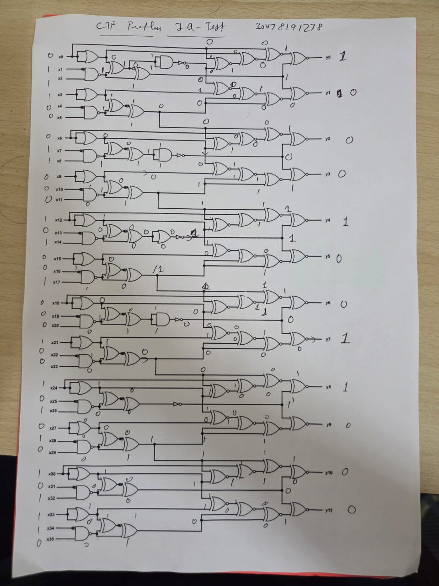
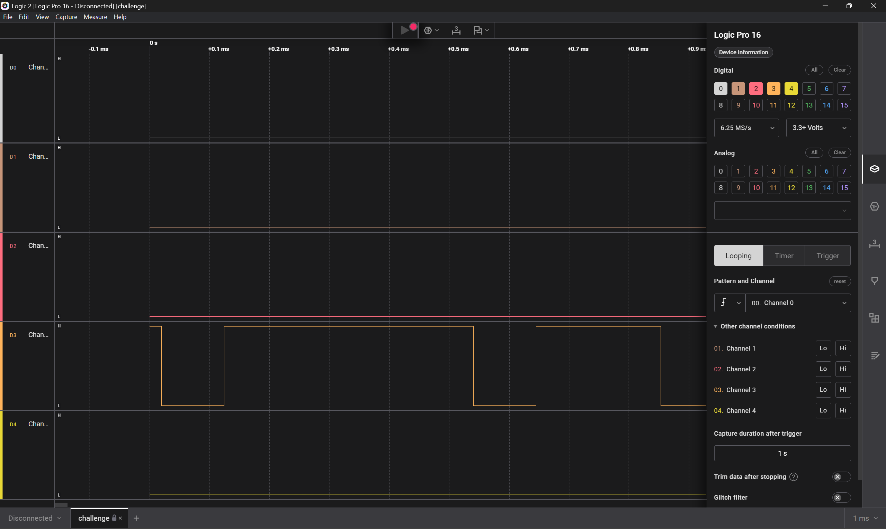
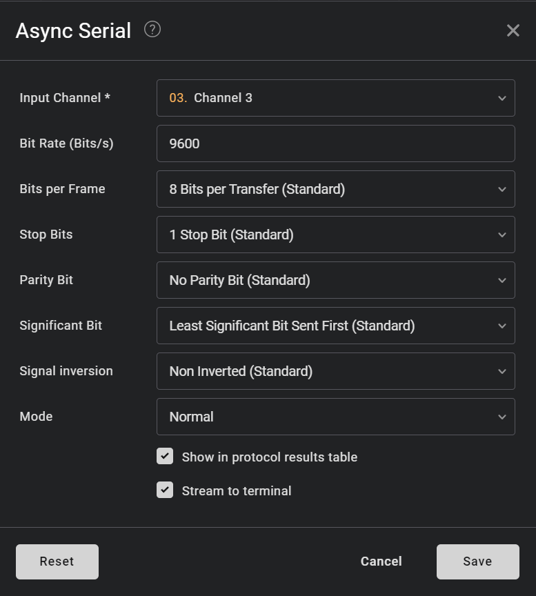
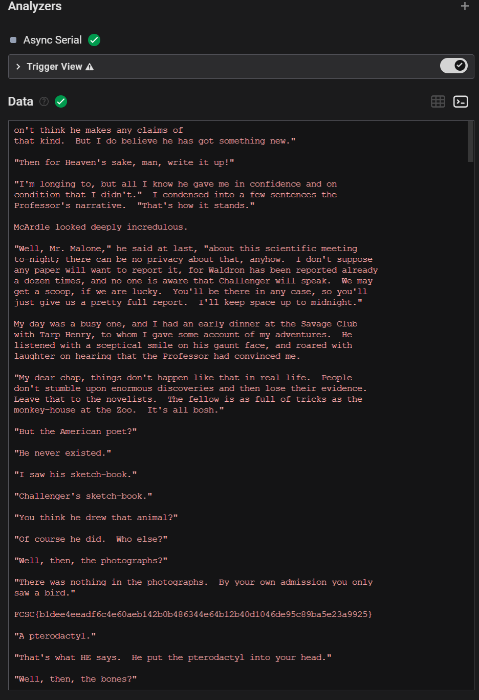
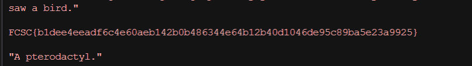

# 1.iq test
>let your input x = 30478191278. 
>wrap your answer with nite{ } for the flag.
>As an example, entering x = 34359738368 gives (y0, ..., y11), so the flag would be nite{010000000011}.

Given Image `iqtest.png`

## Solve:
- First I converted the value `30478191278` into binary and got this `11100011000101001000100101010101110`, I added an extra 0 at the beginning to fit it into the entire 36 inputs.
- Then I took a printout and solved the entire circuit manually :(
	
	
- I got `100010011000` as the output

## Flag:
```
nite{100010011000}
```
## Notes and Concepts Learnt:
- This challenge just required basic knowledge of gates to solve.
- Only could be done manually, no script can be made.

# 2. I like Logic
>i like logic and i like files, apparently, they have something in common, what should my next step be.

## Solve:
- The challenge made me download a `.sal` file. On further looking on google, I found that `.sal` files were produced by a software called `Saleae Logic Software`. So I installed the software on my system and opened the file.
	
- I had no idea how to proceed further. I googled around and landed on a youtube video titled `Decoding UART, I2C and a non-standard signal // With Saleae logic analyzer and temperature sensors`.
- Through that I was able to analyze that this was a `UART` signal, and could be analyzed through a Analyzer in the software called "Async Serial".
	
- Then in the analyzer's tab, I could look at the decoded text from the signal.
	
- The decoded text had the flag
	

## Flag:
```
FCSC{b1dee4eeadf6c4e60aeb142b0b486344e64b12b40d1046de95c89ba5e23a9925}
```

## Notes and Concepts Learnt:
- I learnt what are `.sal` extension files
- UART signals are used for serial data communication between devices.
- I learnt the usage of the `Saleae Logic` software and how it used to analyze signals.
- Youtube link: https://www.youtube.com/watch?v=jocVpFqlpOo
