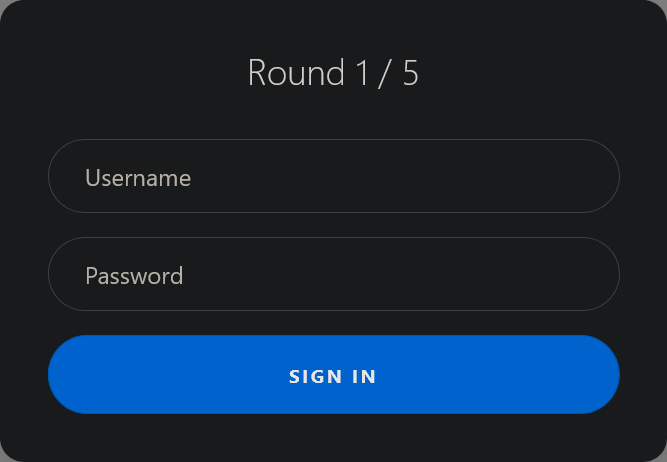
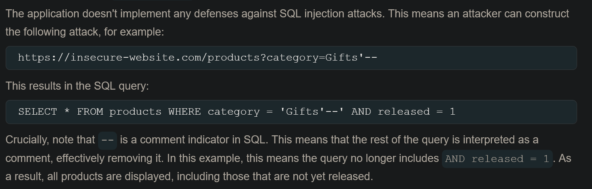
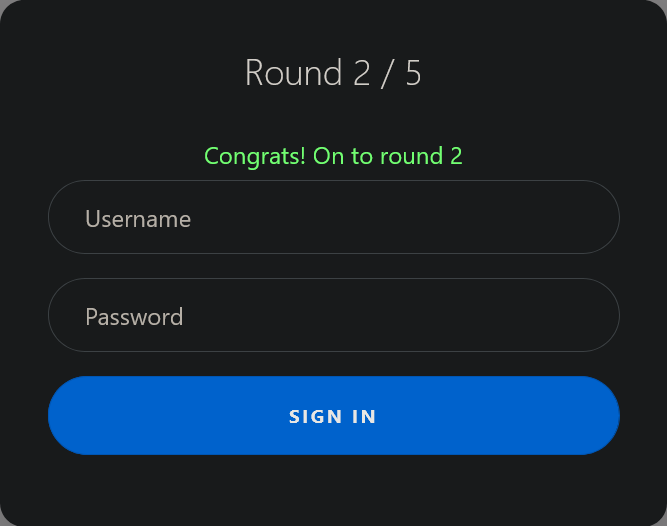
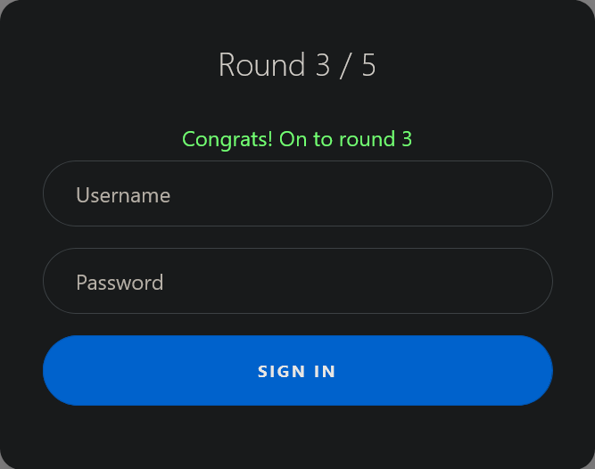
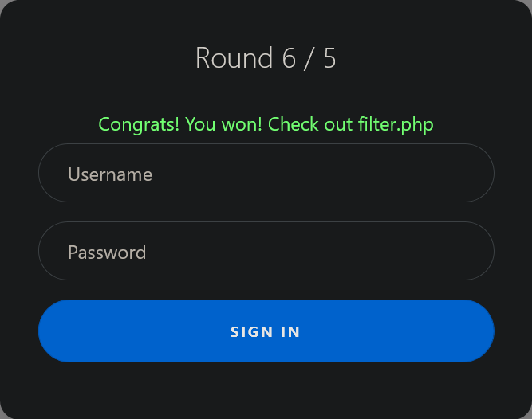
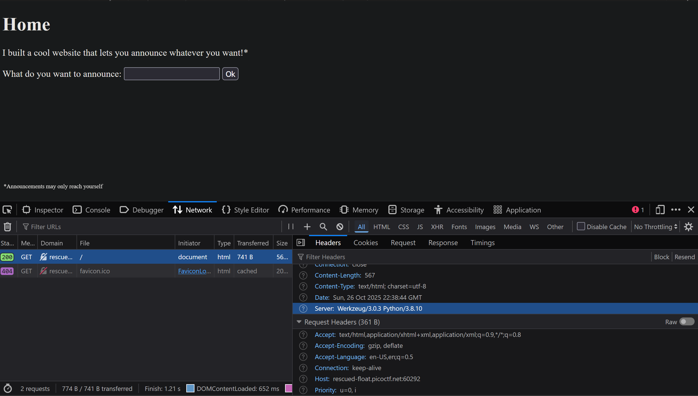
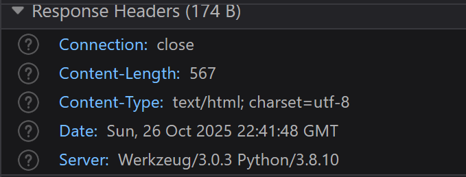
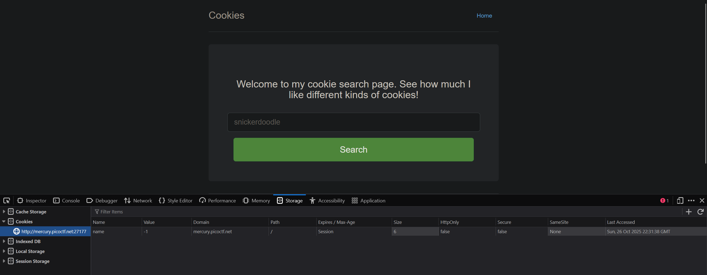
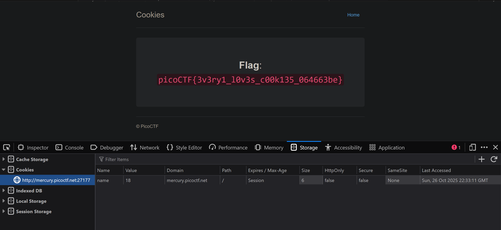

# 1. Web Gauntlet
>Can you beat the filters? Log in as admin http://shape-facility.picoctf.net:54186/ http://shape-facility.picoctf.net:54186/filter.php

## Solve:
- I was given two website ports, entering the first one I got this
	
	
- Enter any redundant data, this was shown on the top of the webpage: `SELECT * FROM users WHERE username='admin ' AND password='admin123'`
- I had read about SQL Injections before, so I searched up SQL injections and landed on `portswigger.net`. For the first round I found this-
	
	
- Using that, I was able to easily solve the First round, I just put a delimiter `'` and `--` after `admin` in the username, what this did was it first delimited the username field and `--` was used to comment out the `password` field which meant any password could be used.
- Now on to the second round, filtered words were `Round2: or and like = --`.
	
	
- Here `--` was filtered out so I used `/*` to comment out the `password` field.
	
	- 
-  This time the filters were `Round3: or and = like > < --`
- Again the same injection could be used, moving to round 4, here the filters were `Round4: or and = like > < -- admin`
- Here the admin key was blacklisted so I read around the website and was able to locate another injection.
- Basically I ran the same `/*` but to use the admin key word I used `||`, `ad||min` but that didn't seem to work at first, I looked around more and figured that I put the delimiter at the wrong place, finally I used this `admi'||'n'/*` which worked and I moved on to round 5.
- Here only the union keyword was banned, so the same injection worked from round 4.
- After round 5 I was shown this,
	
	- 
- Checking out `filter.php`, I got the flag.

## Flag:
```
picoCTF{y0u_m4d3_1t_79a0ddc6}
```

## Notes and Concepts Learnt:
- I learnt how to perform SQL injections
- This challenged taught me how vulnerable SQL code can be.
- Resource used: https://portswigger.net/web-security/sql-injection


## 2. SSTI1

>I made a cool website where you can announce whatever you want! Try it out! I heard templating is a cool and modular way to build web apps! Check out my website [here](http://rescued-float.picoctf.net:60292/)!

## Solve:
- The first thing I did, was opening up the inspector in my firefox window and looking at the network section. 
- In there, I looked at the `GET` request
	
	
-  Through which I could see that the server was running python.
	
	
- Then looking at one of the hints, I could identify that the attack used here was `Server Side Template Injection`, having no prior knowledge regarding this, I searched up "python server side template injection" on google.
- I landed on a website called "yeswehack.com", and it listed common `SSTI` attacks and the first one for python's `jinja2` which is the default template engine in `Flask`. 
- I sent the first payload given `{{self.__init__.__globals__.__str__()[1786:1789]}}` which actually worked and printed `id` as said on the website.
- I modified the second payload given which was to run a system command to list all the files in the current working directory. The command used was `{{self._TemplateReference__context.cycler.__init__.__globals__.os.popen("ls").read()}}`
  
	
- So there was a file called `flag` in the same directory, again running the same injection but this time using `cat flag`, I was able to get the flag. `{{self._TemplateReference__context.cycler.__init__.__globals__.os.popen("cat flag").read()}}`
	
	

## Flag:
```
picoCTF{s4rv3r_s1d3_t3mp14t3_1nj3ct10n5_4r3_c001_9451989d}
```
## Notes and Concepts Learnt:
- I learnt what is Server Side Template Injection, It is when attackers exploit the webpage's template's native syntax and injects malicious payloads into the template and is used to extort vulnerable data from the server which is hosting the web page.
- I learnt how to send payloads.

# 3. Cookies
>Who doesn't love cookies? Try to figure out the best one. [http://mercury.picoctf.net:27177/](http://mercury.picoctf.net:27177/)

## Solve:
- This challenge was pretty straightforward, and could be easily solved through brute force. There was a `cookie` whose value could be changed to produce different results.
  
	
- After going through numbers starting from 1, I finally found the right value to output the flag which was `18`
  
	

## Flag:
```
picoCTF{3v3ry1_l0v3s_c00k135_064663be}
```

## Notes and Concepts Learnt:
- I learnt how changing the values of cookies on a website could alter the text shown.
